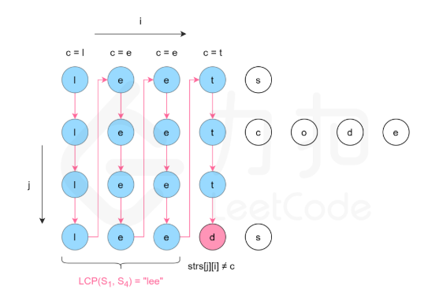

## 题目说明	2020年7月25日16:16:31

https://leetcode-cn.com/problems/longest-common-prefix/

> 编写一个函数来查找字符串数组中的最长公共前缀。
>
> 如果不存在公共前缀，返回空字符串 `""`
>

```
输入: ["flower","flow","flight"]
输出: "fl"
```

```
输入: ["dog","racecar","car"]
输出: ""
解释: 输入不存在公共前缀。
```

**说明:**

所有输入只包含小写字母 `a-z` 。

## 题解

### 解法一：纵向扫描（暴力法）

纵向扫描时，从前往后遍历所有字符串的每一列，比较相同列上的字符是否相同，如果相同则继续对下一列进行比较，如果不相同则当前列不再属于公共前缀，当前列之前的部分为最长公共前缀。

结束循环标准：

- 当前串长度小于要比较的位置
- 当前比较的字符与该位置应有的公共字符不同




**时间复杂度：O(mn)，其中m是字符串平均长度，n是字符串数组长度**

```java
class Solution {
    public String longestCommonPrefix(String[] strs) {
        if (strs==null ||strs.length==0)
            return "";
        for (int i=0;i<strs[0].length();++i){
            char c=strs[0].charAt(i);
            for (int j=1;j<strs.length;++j){
                if (i==strs[j].length() ||strs[j].charAt(i)!=c)
                    return strs[0].substring(0,i);
            }
        }
        return strs[0];
    }
}
```


### 解法二：横向扫描

- 每两个子串匹配一个公共子串

- 拿着个公共子串和下一个子串匹配

- 最后剩下的结果就是最长公共子串

**时间复杂度：O(mn)，其中m是字符串平均长度，n是字符串数组长度**

 ```java
class Solution {
    public String longestCommonPrefix(String[] strs) {
        if (strs==null ||strs.length==0)
            return "";
        String res=strs[0];
        for (int i=1;i<strs.length;++i){
            res=compare(res,strs[i]);
            if (res.length()==0)
                break;
        }
        return res;
    }
    public String compare(String str1,String str2){
        int min=Math.min(str1.length(),str2.length());
        int i;
        for (i=0;i<min && str1.charAt(i)==str2.charAt(i);++i){}
        return str1.substring(0,i);
    }
}
 ```