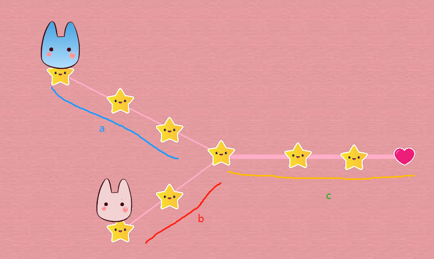

## 题目描述	2020年8月21日21:17:48

https://leetcode-cn.com/problems/intersection-of-two-linked-lists/description/

编写一个程序，找到两个单链表相交的起始节点。

如下面的两个链表**：**


在节点 c1 开始相交。

 

**示例 1：**


```
输入：intersectVal = 8, listA = [4,1,8,4,5], listB = [5,0,1,8,4,5], skipA = 2, skipB = 3
输出：Reference of the node with value = 8
输入解释：相交节点的值为 8 （注意，如果两个链表相交则不能为 0）。从各自的表头开始算起，链表 A 为 [4,1,8,4,5]，链表 B 为 [5,0,1,8,4,5]。在 A 中，相交节点前有 2 个节点；在 B 中，相交节点前有 3 个节点。
```

 

**示例 2：**


```
输入：intersectVal = 2, listA = [0,9,1,2,4], listB = [3,2,4], skipA = 3, skipB = 1
输出：Reference of the node with value = 2
输入解释：相交节点的值为 2 （注意，如果两个链表相交则不能为 0）。从各自的表头开始算起，链表 A 为 [0,9,1,2,4]，链表 B 为 [3,2,4]。在 A 中，相交节点前有 3 个节点；在 B 中，相交节点前有 1 个节点。
```

 

**示例 3：**


```
输入：intersectVal = 0, listA = [2,6,4], listB = [1,5], skipA = 3, skipB = 2
输出：null
输入解释：从各自的表头开始算起，链表 A 为 [2,6,4]，链表 B 为 [1,5]。由于这两个链表不相交，所以 intersectVal 必须为 0，而 skipA 和 skipB 可以是任意值。
解释：这两个链表不相交，因此返回 null。
```

 

**注意：**

- 如果两个链表没有交点，返回 `null`.
- 在返回结果后，两个链表仍须保持原有的结构。
- 可假定整个链表结构中没有循环。
- 程序尽量满足 O(*n*) 时间复杂度，且仅用 O(*1*) 内存。

## 题解

### 解法一：

- 如果两链表有交点，那么从该交点向后到尾部的距离对两个链表来说应该是相同的，即对两链表来说，从最后一个结点到交点的距离是相同的。
- 设立两个指针分别指向两个链表，将两指针调整到距离尾部的距离相等，每次移动一个节点，如果两链表有交点那么一定会在移动的过程中相遇。

注意：

- 调整链表距离时，可以先对两链表遍历出长度，然后让长的链表的指针先向后移动（两长度的差）的长度，然后再同时向后移动

**时间复杂度：O（N）**

**空间复杂度：O（1）**

```java
import java.util.List;

/*
 * @lc app=leetcode.cn id=160 lang=java
 *
 * [160] 相交链表
 */

// @lc code=start

//   Definition for singly-linked list.
 public class ListNode {
    int val;
    ListNode next;

    ListNode(int x) {
        val = x;
        next = null;
    }
} 

public class Solution {
    public ListNode getIntersectionNode(ListNode headA, ListNode headB) {
        int acount = 0;
        int bcount = 0;
        ListNode p = headA, q = headB;
        while (p != null) {
            ++acount;
            p = p.next;
        }
        while (q != null) {
            ++bcount;
            q = q.next;
        }
        p = headA;
        q = headB;
        for (int i = 0; i < acount - bcount; i++) {
            p = p.next;
        }
        for (int i = 0; i < bcount - acount; i++) {
            q = q.next;
        }
        while (p!=null && q!=null) {
            if (p==q) {
                return p;
            }
            p = p.next;
            q = q.next;
        }
        return null;
    }
}
// @lc code=end

```

### 解法二：错的人迟早会走散，而对的人迟早会相逢！



a+c+b==b+c+a

- 如果不相交，二者将会在null相遇

```java
import java.util.List;

/*
* @lc app=leetcode.cn id=160 lang=java
*
* [160] 相交链表
*/

// @lc code=start

//   Definition for singly-linked list.
/* public class ListNode {
    int val;
    ListNode next;

    ListNode(int x) {
        val = x;
        next = null;
    }
} */

public class Solution {
    public ListNode getIntersectionNode(ListNode headA, ListNode headB) {
        ListNode p = headA;
        ListNode q = headB;
        while (p != q) {
            if (p == null) 
                p = headB;
            else
                p=p.next;
            if (q == null) 
                q = headA;
            else
                q = q.next;
        }
        return p;
    }

}
// @lc code=end

```

