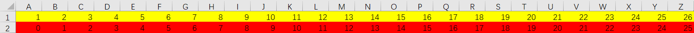
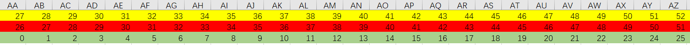

## 题目描述	2020年8月26日16:43:26

https://leetcode-cn.com/problems/excel-sheet-column-title/description/

给定一个正整数，返回它在 Excel 表中相对应的列名称。

例如，

```
    1 -> A
    2 -> B
    3 -> C
    ...
    26 -> Z
    27 -> AA
    28 -> AB 
    ...
```

**示例 1:**

```
输入: 1
输出: "A"
```

**示例 2:**

```
输入: 28
输出: "AB"
```

**示例 3:**

```
输入: 701
输出: "ZY"
```

## 题解

### 解法一：





常规解法可以解决大部分情况，只有一种除外，那就是对26取余余数为0的时候（即最后一位为Z的时候）。这时候我们进行特殊处理，把n减一然后再取余。这时就有一个问题，对n减一之后整个数就变了，不会影响后面数的计算吗？

答案是不会的。因为我们是对每一位进行的计算而且只有当最低位为Z时才减一，这时只是把最低位的Z变成了Y，而在本次循环结束时就会把最低位给抹除，不管是Z还是Y，这时都没了所以不会影响接下来的循环。

这时我们观察代码如下：

```java
/*
 * @lc app=leetcode.cn id=168 lang=java
 *
 * [168] Excel表列名称
 */

// @lc code=start
class Solution {
    public String convertToTitle(int n) {
        StringBuilder sBuilder = new StringBuilder();
        while (n > 0) {
            if(n%26==0){	//结尾为Z
				n-=1;
                sBuilder.append((char)('A'+tmp%26));
            }else{
				sBuilder.append((char) ('A' + n % 26-1));	
            }
            n /= 26;
        }
        return sBuilder.reverse().toString();
    }

}
// @lc code=end

```

我们发现ifelse里边的代码高度相似。可以对相同部分抽取变成如下代码。

```java
/*
 * @lc app=leetcode.cn id=168 lang=java
 *
 * [168] Excel表列名称
 */

// @lc code=start
class Solution {
    public String convertToTitle(int n) {
        StringBuilder sBuilder = new StringBuilder();
        while (n > 0) {
            n -= 1;
            sBuilder.append((char) ('A' + n % 26));
            n /= 26;
        }
        return sBuilder.reverse().toString();
    }

}
// @lc code=end

```

