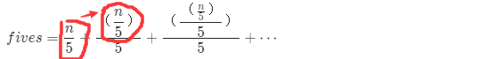

## 题目描述	2020年9月8日18:27:03

https://leetcode-cn.com/problems/factorial-trailing-zeroes/description/

给定一个整数 *n*，返回 *n*! 结果尾数中零的数量。

**示例 1:**

```
输入: 3
输出: 0
解释: 3! = 6, 尾数中没有零。
```

**示例 2:**

```
输入: 5
输出: 1
解释: 5! = 120, 尾数中有 1 个零.
```

**说明:** 你算法的时间复杂度应为 *O*(log *n*) 。

## 题解

### 解法一：暴力法

算完再看有多少0，注意Java要用BigInteger计算防止溢出。

### 解法二：计算因子5

- 如果结尾有0，则说明10是该结果的因子。
- 而10的因子又是2和5
- 则统计该数中到底有多少2,5因子。最终能凑成多少对，就是多少个10因子，也就是结尾有多少个0。

**注意：**

- 要统计每个数字的因子。而每个数字可能不止有一个因子
- 2因子的数量肯定是比5因子多的，所以说能凑成的因子对一定取决于5因子的个数。所以只需要统计5因子的个数。

**时间复杂度：O(N)**

```java
/*
 * @lc app=leetcode.cn id=172 lang=java
 *
 * [172] 阶乘后的零
 */

// @lc code=start
class Solution {
    public int trailingZeroes(int n) {
        if (n < 5)
            return 0;
        int fives = 0;
        for (int i = 5; i <= n; i += 5) {
            int powerOf5 = 5;
            while (i % powerOf5 == 0) {
                fives++;				//能被5整除说明有1个5因子，能被25整除说明有俩，125则有仨……
                powerOf5 *= 5;			//也可以将每个i每次除5，能除多少次，说明有多少个5因子
            }
        }
        return fives;
    }
}
// @lc code=end

```

**注：**该方法超时，但是不失为一个不错的思路

### 解法三：高效计算因子5

- n个数有多少个5因子，n/5得到的结果就是有多少数能被5整除。
- 但这是是部分结果，因为有的数有多个5因子。比如25，他有2个5因子。
- 这时可以n/25，计算哪些数能有2个5因子，再把这些数的第二个5因子添加到因子总数里。
- 这些数在第一次迭代中已经将自己的第一个5因子计入总数。
- 这样就解决了多重因子问题。

说人话：

- 1,2,3，……，N。这些数每5个数有一个5因子，每25个数还有一个额外的5因子，每125个数还有一个额外的5因子……



```java
/*
 * @lc app=leetcode.cn id=172 lang=java
 *
 * [172] 阶乘后的零
 */

// @lc code=start
class Solution {
    public int trailingZeroes(int n) {
        if (n < 5)
            return 0;
        int fives = 0;
        while (n > 0) {
            n /= 5;
            fives += n;
        }
        return fives;
    }
}
// @lc code=end

```

