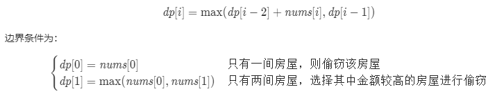

## 题目描述	2020年9月22日20:58:01

https://leetcode-cn.com/problems/house-robber/description/

你是一个专业的小偷，计划偷窃沿街的房屋。每间房内都藏有一定的现金，影响你偷窃的唯一制约因素就是相邻的房屋装有相互连通的防盗系统，**如果两间相邻的房屋在同一晚上被小偷闯入，系统会自动报警**。

给定一个代表每个房屋存放金额的非负整数数组，计算你 **不触动警报装置的情况下** ，一夜之内能够偷窃到的最高金额。

 

**示例 1：**

```
输入：[1,2,3,1]
输出：4
解释：偷窃 1 号房屋 (金额 = 1) ，然后偷窃 3 号房屋 (金额 = 3)。
     偷窃到的最高金额 = 1 + 3 = 4 。
```

**示例 2：**

```
输入：[2,7,9,3,1]
输出：12
解释：偷窃 1 号房屋 (金额 = 2), 偷窃 3 号房屋 (金额 = 9)，接着偷窃 5 号房屋 (金额 = 1)。
     偷窃到的最高金额 = 2 + 9 + 1 = 12 。
```

 

**提示：**

- `0 <= nums.length <= 100`
- `0 <= nums[i] <= 400`

## 题解

### 解法一：动态规划

首先考虑最简单的情况。如果只有一间房屋，则偷窃该房屋，可以偷窃到最高总金额。如果只有两间房屋，则由于两间房屋相邻，不能同时偷窃，只能偷窃其中的一间房屋，因此选择其中金额较高的房屋进行偷窃，可以偷窃到最高总金额。

如果房屋数量大于两间，应该如何计算能够偷窃到的最高总金额呢？对于第 k~(k>2)k (k>2) 间房屋，有两个选项：

1. 偷窃第 kk 间房屋，那么就不能偷窃第 k-1k−1 间房屋，偷窃总金额为前 k-2k−2 间房屋的最高总金额与第 kk 间房屋的金额之和。

2. 不偷窃第 kk 间房屋，偷窃总金额为前 k-1k−1 间房屋的最高总金额。

在两个选项中选择偷窃总金额较大的选项，该选项对应的偷窃总金额即为前 kk 间房屋能偷窃到的最高总金额。

用 dp[i]dp[i] 表示前 ii 间房屋能偷窃到的最高总金额，那么就有如下的状态转移方程：


最终的答案即为dp[n−1]，其中 n 是数组的长度。

**滚动数组**

```java
/*
 * @lc app=leetcode.cn id=198 lang=java
 *
 * [198] 打家劫舍
 */

// @lc code=start
class Solution {
    public int rob(int[] nums) {

        if (nums.length == 0 || nums == null) {
            return 0;
        }
        if (nums.length == 1) {
            return nums[0];
        }
        int[] dp = new int[nums.length];
        dp[0] = nums[0];
        dp[1] = Math.max(nums[0], nums[1]);
        for (int i = 2; i < dp.length; i++) {
            dp[i] = Math.max(nums[i] + dp[i - 2], dp[i - 1]);
        }
        return dp[nums.length-1];
    }
    public static void main(String[] args) {
        System.out.println(new Solution().rob(new int[]{1,2,3,1}));
    }
}
// @lc code=end

```

**哨兵：**

```java
/*
 * @lc app=leetcode.cn id=198 lang=java
 *
 * [198] 打家劫舍
 */

// @lc code=start
class Solution {
    public int rob(int[] nums) {

        if (nums.length == 0 || nums == null) {
            return 0;
        }
        if (nums.length == 1) {
            return nums[0];
        }
        int first = nums[0];
        int second = Math.max(first, nums[1]);
        for (int i = 2; i < nums.length; i++) {
            int third = Math.max(nums[i] + first, second);
            first = second;
            second = third;

        }
        return second;
    }

    public static void main(String[] args) {
        System.out.println(new Solution().rob(new int[] { 1, 2, 3, 1 }));
    }
}
// @lc code=end

```

