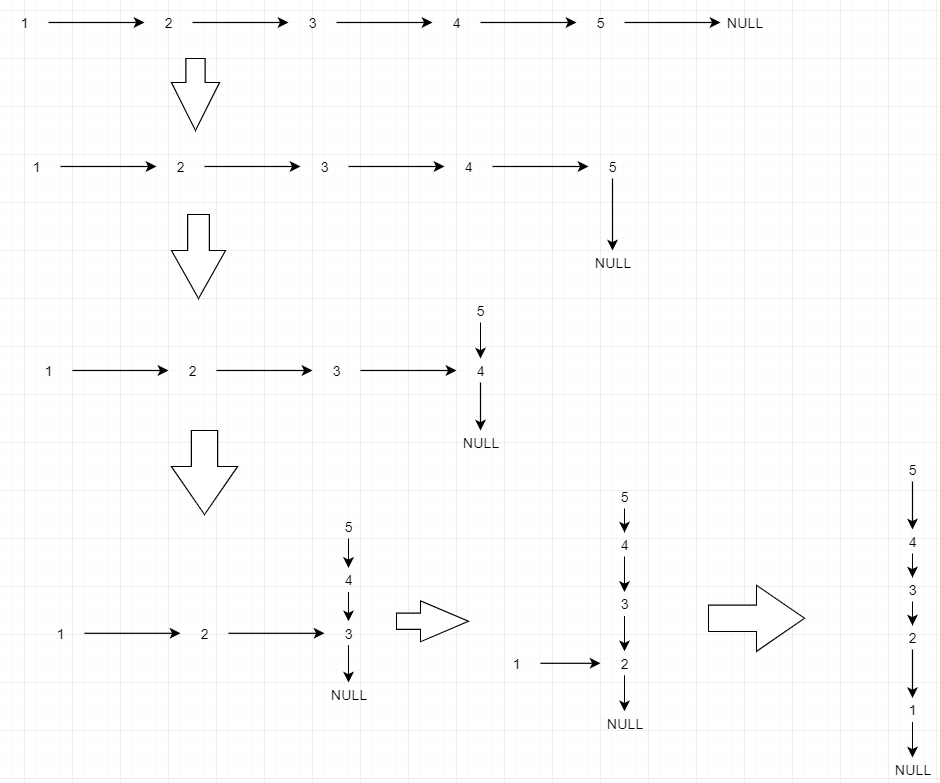

## 题目描述	2020年10月5日10:21:06

https://leetcode-cn.com/problems/reverse-linked-list/description/

反转一个单链表。

**示例:**

```
输入: 1->2->3->4->5->NULL
输出: 5->4->3->2->1->NULL
```

**进阶:**
你可以迭代或递归地反转链表。你能否用两种方法解决这道题？

## 题解

### 解法一：迭代法

```java
/*
 * @lc app=leetcode.cn id=206 lang=java
 *
 * [206] 反转链表
 */

// @lc code=start

//  Definition for singly-linked list.
/* public class ListNode {
    int val;
    ListNode next;

    ListNode(int x) {
        val = x;
    }
} */

class Solution {
    public ListNode reverseList(ListNode head) {
        if (head == null) {
            return null;
        }
        ListNode reshead, p, q;
        reshead = head;
        p = head.next;
        reshead.next = null;
        while (p != null) {
            q = p.next;
            p.next = reshead;
            reshead = p;
            p = q;
        }
        return reshead;
    }
}
// @lc code=end

```

### 解法二：递归法

**思路：**

先想想这个函数的功能：反转字符串。假设这个函数已经实现了该功能，在一次递归中可以调用该功能。把该问题划分为两个部分，一个是本次递归的因子（在本题中可理解为结点），另一个整体，但他可以是用该函数可以实现的某一返回值。主要思考这一因子和这一返回值如何实现一次递归的功能。

- 本题的递归点在于：把当前结点放在“下一个结点开始处的子链表的反转结果”的尾部。
- 重点注意，子链表反转结束后当前结点仍指向反转前的子链表表头，也就是反转后的子链表表尾。



```java
import java.util.List;

/*
 * @lc app=leetcode.cn id=206 lang=java
 *
 * [206] 反转链表
 */

// @lc code=start

//  Definition for singly-linked list.
/* public class ListNode {
    int val;
    ListNode next;

    ListNode(int x) {
        val = x;
    }
} */

class Solution {
    public ListNode reverseList(ListNode head) {
        if (head == null || head.next == null) {
            return head;
        }
        ListNode p = reverseList(head.next);
        head.next.next=head;
        head.next=null;
        return p;
    }
}
// @lc code=end

```

