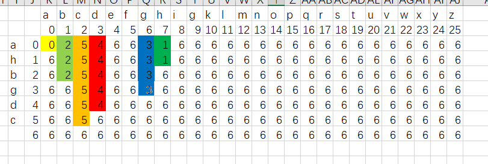

## 题目描述	2020年10月19日16:35:47

https://leetcode-cn.com/problems/is-subsequence/description/

给定字符串 **s** 和 **t** ，判断 **s** 是否为 **t** 的子序列。

你可以认为 **s** 和 **t** 中仅包含英文小写字母。字符串 **t** 可能会很长（长度 ~= 500,000），而 **s** 是个短字符串（长度 <=100）。

字符串的一个子序列是原始字符串删除一些（也可以不删除）字符而不改变剩余字符相对位置形成的新字符串。（例如，`"ace"`是`"abcde"`的一个子序列，而`"aec"`不是）。

**示例 1:**
**s** = `"abc"`, **t** = `"ahbgdc"`

返回 `true`.

**示例 2:**
**s** = `"axc"`, **t** = `"ahbgdc"`

返回 `false`.

**后续挑战** **:**

如果有大量输入的 S，称作S1, S2, ... , Sk 其中 k >= 10亿，你需要依次检查它们是否为 T 的子序列。在这种情况下，你会怎样改变代码？

## 题解

### 解法一：双指针

双指针如果相等，二者向后移；否则只向后移t

```java
class Solution {
    public boolean isSubsequence(String s, String t) {
        int i=0,j=0,m=s.length(),n=t.length();
        while(i<m && j<n){
            if(s.charAt(i)==t.charAt(j)){
                ++i;
            }
                ++j;        
        }
        return i==m;

    }
}
```

### 解法二：动态规划

https://www.cnblogs.com/arknights/articles/13387155.html




```java
class Solution {
    public boolean isSubsequence(String s, String t) {
        int n=s.length(),m=t.length();
        int[][] dp=new int[m+1][26];
        //初始化边界
        for(int i=0;i<26;++i){
            dp[m][i]=m;
        }
        //从后往前建立dp数组
        for(int i=m-1;i>=0;--i){
            for(int j=0;j<26;++j){
                if(t.charAt(i)=='a'+j){
                    dp[i][j]=i;
                }else{
                    dp[i][j]=dp[i+1][j];
                }
            }
        }
        //查找
        int add=0;
        for(int i=0;i<s.length();++i){
            if(dp[add][s.charAt(i)-'a']==m)
                return false;
            else
                add=dp[add][s.charAt(i)-'a']+1;
        }
        return true;
    }
}
```

