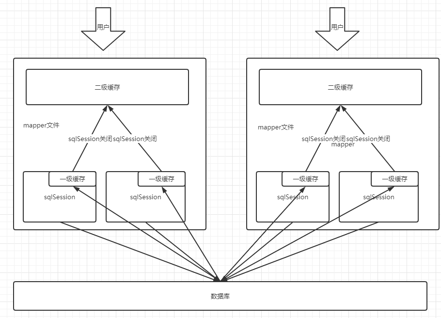

# Mybatis

[mybatis官方中文文档](https://mybatis.org/mybatis-3/zh/sqlmap-xml.html#)

官方文档有中文，且非常详细。

## 一、基础配置

### 导入依赖

```xml
<!-- https://mvnrepository.com/artifact/org.mybatis/mybatis -->
<dependency>
    <groupId>org.mybatis</groupId>
    <artifactId>mybatis</artifactId>
    <version>3.4.6</version>
</dependency>

```

在maven仓库选择依赖时可以尽量选择用的人多的而不是最新的。

### 从 XML 中构建 SqlSessionFactory

mybatis是通过SqlSessionFactory来创建实例的，所以要用下边的方式来获取该工厂。

（由于这些代码是固定的，所以可以写一个工具类来封装。）

```java
String resource = "org/mybatis/example/mybatis-config.xml";	//指定配置文件的位置，视项目而定
InputStream inputStream = Resources.getResourceAsStream(resource);	//获得输入流
SqlSessionFactory sqlSessionFactory = new SqlSessionFactoryBuilder().build(inputStream);	//获取工厂
```

```xml
<?xml version="1.0" encoding="UTF-8" ?>
<!DOCTYPE configuration
  PUBLIC "-//mybatis.org//DTD Config 3.0//EN"
  "http://mybatis.org/dtd/mybatis-3-config.dtd">
<configuration>
  <environments default="development">
    <environment id="development">
      <transactionManager type="JDBC"/>
      <dataSource type="POOLED">
        <property name="driver" value="${driver}"/>
        <property name="url" value="${url}"/>
        <property name="username" value="${username}"/>
        <property name="password" value="${password}"/>
      </dataSource>
    </environment>
  </environments>
    <!--配置映射文件的位置-->
   <mappers>
    <mapper resource="org/mybatis/example/BlogMapper.xml"/>
  </mappers>
</configuration>
```

在默认的情况下maven打包的时候，对于src/main/java目录只打包源代码，而不会打包其他文件。所以此时如果把对应的mapper文件放到src/main/java目录下时，不会打包到最终的jar文件夹中，也不会输出到target文件夹中。由于在进行单元测试的时候执行的是/target目录下/test-classes下的代码，所以在测试的时候也不会成功。

(springboot中好像不会出现这种问题，实测只指定了映射文件地址：

`mapper-locations: classpath:mybatis/mapper/*.xml`

项目即可正常运行，不存在maven打包问题，而且mapper类和文件不再同一文件夹下，也能执行。

但这个例子里映射文件释放在了resources文件夹下)

解决方案：

1. 可以通过将接口文件放在src/main/java某个包中，而在src/main/resources目录中建立同样的包，这是一种约定优于配置的方式，这样在maven打包的时候就会将src/main/java和src/main/resources相同包下的文件合并到同一包中。
2. 若要把接口和mapper文件全部放到src/main/java中同一包中，就要对maven进行配置，使其把xml文件也打包到target文件中。

上述是针对映射器为：`<package name="org.mybatis.builder"/>`的情况，要求必须在打在同一包内。

如果用`<mapper resource="org/mybatis/example/BlogMapper.xml"/>`指定，则不需要打在同一包内。

```xml
<build>
	<resources> 
      	<resource> 
             <directory>src/main/java</directory> 
             <includes> 
                 <include>**/*.properties</include> 
                 <include>**/*.xml</include> 
             </includes> 
             <filtering>true</filtering> 
      	</resource> 
	</resources> 
</build>
```

### 从 SqlSessionFactory 中获取 SqlSession

SqlSession 提供了在数据库执行 SQL 命令所需的所有方法。你可以通过 SqlSession 实例来直接执行已映射的 SQL 语句,例如：

```java
try (SqlSession session = sqlSessionFactory.openSession()) {
    //获取一个映射，参数为接口的类对象
    //这里获取到的其实就是Dao接口，拿到该对象后就能执行接口中的方法
  BlogMapper mapper = session.getMapper(BlogMapper.class);
  	//执行接口中定义的方法
  Blog blog = mapper.selectBlog(101);
}
```

使用springboot后，就不需要这一步。

### 映射sql语句

```xml
<?xml version="1.0" encoding="UTF-8" ?>
<!DOCTYPE mapper
  PUBLIC "-//mybatis.org//DTD Mapper 3.0//EN"
  "http://mybatis.org/dtd/mybatis-3-mapper.dtd">
<!--命名空间为要绑定的接口的全限定名-->
<mapper namespace="org.mybatis.example.BlogMapper">
    <!--id对应接口中的方法名，resultType对应返回类型的全限定名-->
  <select id="selectBlog" resultType="org.mybatis.pojo.Blog">
    select * from Blog where id = #{id}
  </select>
</mapper>
```

这一步相当于实现了绑定的接口

## 二、CRUD

### select

示例：

```xml
<select id="selectPerson" parameterType="int" resultType="hashmap">
  SELECT * FROM PERSON WHERE ID = #{id}
</select>
```

如果参数唯一的话，#{}里边写啥都行。

**Select 元素的属性：**

```xml
<select
  id="selectPerson"
  parameterType="int"
  parameterMap="deprecated"
  resultType="hashmap"
  resultMap="personResultMap"
  flushCache="false"
  useCache="true"
  timeout="10"
  fetchSize="256"
  statementType="PREPARED"
  resultSetType="FORWARD_ONLY">
```

| 属性            | 描述                                                         |
| :-------------- | :----------------------------------------------------------- |
| `id`            | 在命名空间中唯一的标识符，可以被用来引用这条语句。           |
| `parameterType` | 将会传入这条语句的参数的类全限定名或别名。这个属性是可选的，因为 MyBatis 可以通过类型处理器（TypeHandler）推断出具体传入语句的参数，默认值为未设置（unset）。 |
| parameterMap    | 用于引用外部 parameterMap 的属性，目前已被废弃。请使用行内参数映射和 parameterType 属性。 |
| `resultType`    | 期望从这条语句中返回结果的类全限定名或别名。 注意，如果返回的是集合，那应该设置为集合包含的类型，而不是集合本身的类型。 resultType 和 resultMap 之间只能同时使用一个。 |
| `resultMap`     | 对外部 resultMap 的命名引用。结果映射是 MyBatis 最强大的特性，如果你对其理解透彻，许多复杂的映射问题都能迎刃而解。 resultType 和 resultMap 之间只能同时使用一个。 |
| `flushCache`    | 将其设置为 true 后，只要语句被调用，都会导致本地缓存和二级缓存被清空，默认值：false。 |
| `useCache`      | 将其设置为 true 后，将会导致本条语句的结果被二级缓存缓存起来，默认值：对 select 元素为 true。 |
| `timeout`       | 这个设置是在抛出异常之前，驱动程序等待数据库返回请求结果的秒数。默认值为未设置（unset）（依赖数据库驱动）。 |
| `fetchSize`     | 这是一个给驱动的建议值，尝试让驱动程序每次批量返回的结果行数等于这个设置值。 默认值为未设置（unset）（依赖驱动）。 |
| `statementType` | 可选 STATEMENT，PREPARED 或 CALLABLE。这会让 MyBatis 分别使用 Statement，PreparedStatement 或 CallableStatement，默认值：PREPARED。 |
| `resultSetType` | FORWARD_ONLY，SCROLL_SENSITIVE, SCROLL_INSENSITIVE 或 DEFAULT（等价于 unset） 中的一个，默认值为 unset （依赖数据库驱动）。 |
| `databaseId`    | 如果配置了数据库厂商标识（databaseIdProvider），MyBatis 会加载所有不带 databaseId 或匹配当前 databaseId 的语句；如果带和不带的语句都有，则不带的会被忽略。 |
| `resultOrdered` | 这个设置仅针对嵌套结果 select 语句：如果为 true，将会假设包含了嵌套结果集或是分组，当返回一个主结果行时，就不会产生对前面结果集的引用。 这就使得在获取嵌套结果集的时候不至于内存不够用。默认值：`false`。 |
| `resultSets`    | 这个设置仅适用于多结果集的情况。它将列出语句执行后返回的结果集并赋予每个结果集一个名称，多个名称之间以逗号分隔。 |

### insert, update 和 delete

增删改必须要提交事务：`sqlSession.commit()`

但是可以在获得SqlSession时，设置自动提交事务，就可以不用再手动提交事务。

```java
SqlSession session = sqlSessionFactory.openSession(true);   
```

示例：

```xml
<insert id="insertAuthor">
  insert into Author (id,username,password,email,bio)
  values (#{id},#{username},#{password},#{email},#{bio})
</insert>

<update id="updateAuthor">
  update Author set
    username = #{username},
    password = #{password},
    email = #{email},
    bio = #{bio}
  where id = #{id}
</update>

<delete id="deleteAuthor">
  delete from Author where id = #{id}
</delete>
```

**Insert, Update, Delete 元素的属性:**

```xml
<insert
  id="insertAuthor"
  parameterType="domain.blog.Author"
  flushCache="true"
  statementType="PREPARED"
  keyProperty=""
  keyColumn=""
  useGeneratedKeys=""
  timeout="20">

<update
  id="updateAuthor"
  parameterType="domain.blog.Author"
  flushCache="true"
  statementType="PREPARED"
  timeout="20">

<delete
  id="deleteAuthor"
  parameterType="domain.blog.Author"
  flushCache="true"
  statementType="PREPARED"
  timeout="20">
```

| 属性               | 描述                                                         |
| :----------------- | :----------------------------------------------------------- |
| `id`               | 在命名空间中唯一的标识符，可以被用来引用这条语句。           |
| `parameterType`    | 将会传入这条语句的参数的类全限定名或别名。这个属性是可选的，因为 MyBatis 可以通过类型处理器（TypeHandler）推断出具体传入语句的参数，默认值为未设置（unset）。 |
| `parameterMap`     | 用于引用外部 parameterMap 的属性，目前已被废弃。请使用行内参数映射和 parameterType 属性。 |
| `flushCache`       | 将其设置为 true 后，只要语句被调用，都会导致本地缓存和二级缓存被清空，默认值：（对 insert、update 和 delete 语句）true。 |
| `timeout`          | 这个设置是在抛出异常之前，驱动程序等待数据库返回请求结果的秒数。默认值为未设置（unset）（依赖数据库驱动）。 |
| `statementType`    | 可选 STATEMENT，PREPARED 或 CALLABLE。这会让 MyBatis 分别使用 Statement，PreparedStatement 或 CallableStatement，默认值：PREPARED。 |
| `useGeneratedKeys` | （仅适用于 insert 和 update）这会令 MyBatis 使用 JDBC 的 getGeneratedKeys 方法来取出由数据库内部生成的主键（比如：像 MySQL 和 SQL Server 这样的关系型数据库管理系统的自动递增字段），默认值：false。 |
| `keyProperty`      | （仅适用于 insert 和 update）指定能够唯一识别对象的属性，MyBatis 会使用 getGeneratedKeys 的返回值或 insert 语句的 selectKey 子元素设置它的值，默认值：未设置（`unset`）。如果生成列不止一个，可以用逗号分隔多个属性名称。 |
| `keyColumn`        | （仅适用于 insert 和 update）设置生成键值在表中的列名，在某些数据库（像 PostgreSQL）中，当主键列不是表中的第一列的时候，是必须设置的。如果生成列不止一个，可以用逗号分隔多个属性名称。 |
| `databaseId`       | 如果配置了数据库厂商标识（databaseIdProvider），MyBatis 会加载所有不带 databaseId 或匹配当前 databaseId 的语句；如果带和不带的语句都有，则不带的会被忽略。 |

### 多参数问题

如果要传入多个参数有三种解决方法：

1. 索引法

由于是多参数那么就不能使用parameterType， 改用#｛index｝是第几个就用第几个的索引，索引从0开始。

```java
public List<XXXBean> getXXXBeanList(String xxId, String xxCode);  
```

```xml
<select id="getXXXBeanList" resultType="XXBean">

　　select t.* from tableName where id = #{0} and name = #{1}  

</select>  
```

2. 基于注解（推荐）

由于是多参数那么就不能使用parameterType， 这里在接口中用@Param来指定哪一个

```java
public List<XXXBean> getXXXBeanList(@Param("id")String id, @Param("code")String code);  
```

```xml
<select id="getXXXBeanList" resultType="XXBean">

　　select t.* from tableName where id = #{id} and name = #{code}  

</select>
```

3. Map封装

其中hashmap是mybatis自己配置好的直接使用就行。map中key的名字是那个就在#{}使用那个

```java
public List<XXXBean> getXXXBeanList(HashMap map);  
```

```xml
<select id="getXXXBeanList" parameterType="hashmap" resultType="XXBean">

　　select 字段... from XXX where id=#{xxId} code = #{xxCode}  

</select> 
```

当用实体类作为参数时，sql中`#{}`的内容必须是参数的字段，这样不够灵活。尤其是参数为多个且属于多个实体类的字段时。这时候可以用map作为参数，把在sql中要使用的所有参数封装成一个map，这样在sql中通过`#{key}`就可以直接提取，并且不受实体类中的字段名称影响，自己可以随意定义key的名称并在sql中使用。

## 三、配置解析

### 属性（properties）

这些属性可以在外部进行配置，并可以进行动态替换。你既可以在典型的 Java 属性文件中配置这些属性，也可以在 properties 元素的子元素中设置。例如：

```xml
<!--配置额外的属性-->
<properties>
  <property name="username" value="dev_user"/>
  <property name="password" value="F2Fa3!33TYyg"/>
</properties>
<!--或者自闭和，这样可以用${}直接引用对应的properties文件中的值-->
<properties resource="org/mybatis/example/config.properties"/>
```

如果一个属性在不只一个地方进行了配置，那么，MyBatis 将按照下面的顺序来加载：

- 首先读取在 properties 元素体内指定的属性。
- 然后根据 properties 元素中的 resource 属性读取类路径下属性文件，或根据 url 属性指定的路径读取属性文件，并覆盖之前读取过的同名属性。
- 最后读取作为方法参数传递的属性，并覆盖之前读取过的同名属性。

```properties
driver=com.mysql.jdbc.Driver
url=....
username=....
password=....
```

设置好的属性可以在整个配置文件中用来替换需要动态配置的属性值。比如:

```xml
<dataSource type="POOLED">
  <property name="driver" value="${driver}"/>
  <property name="url" value="${url}"/>
  <property name="username" value="${username}"/>
  <property name="password" value="${password}"/>
</dataSource>
```

### 类型别名（typeAliases）

类型别名可为 Java 类型设置一个缩写名字。 它仅用于 XML 配置，意在降低冗余的全限定类名书写。例如：

```xml
<typeAliases>
  <typeAlias alias="Author" type="domain.blog.Author"/>
  <typeAlias alias="Blog" type="domain.blog.Blog"/>
  <typeAlias alias="Comment" type="domain.blog.Comment"/>
  <typeAlias alias="Post" type="domain.blog.Post"/>
  <typeAlias alias="Section" type="domain.blog.Section"/>
  <typeAlias alias="Tag" type="domain.blog.Tag"/>
</typeAliases>
```

也可以指定一个包名，MyBatis 会在包名下面搜索需要的 Java Bean，比如：

```xml
<typeAliases>
  <package name="domain.blog"/>
</typeAliases>
```

每一个在包 `domain.blog` 中的 Java Bean，在没有注解的情况下，会使用 Bean 的首字母小写的非限定类名来作为它的别名。 比如 `domain.blog.Author` 的别名为 `author`；若有注解，则别名为其注解值。见下面的例子：

```java
@Alias("author")
public class Author {
    ...
}
```

### 设置（settings）

这是 MyBatis 中极为重要的调整设置，它们会改变 MyBatis 的运行时行为。 下表描述了设置中各项设置的含义、默认值等。

重点设置：

| 设置名                   |                             描述                             | 有效值                                                       | 默认值 |
| :----------------------- | :----------------------------------------------------------: | :----------------------------------------------------------- | :----- |
| cacheEnabled             |   全局性地开启或关闭所有映射器配置文件中已配置的任何缓存。   | true \| false                                                | true   |
| lazyLoadingEnabled       | 延迟加载的全局开关。当开启时，所有关联对象都会延迟加载。 特定关联关系中可通过设置 `fetchType` 属性来覆盖该项的开关状态。 | true \| false                                                | false  |
| useGeneratedKeys         | 允许 JDBC 支持自动生成主键，需要数据库驱动支持。如果设置为 true，将强制使用自动生成主键。尽管一些数据库驱动不支持此特性，但仍可正常工作（如 Derby）。 | true \| false                                                | False  |
| mapUnderscoreToCamelCase | 是否开启驼峰命名自动映射，即从经典数据库列名 A_COLUMN 映射到经典 Java 属性名 aColumn。 | true \| false                                                | False  |
| logImpl                  |    指定 MyBatis 所用日志的具体实现，未指定时将自动查找。     | SLF4J \| LOG4J \| LOG4J2 \| JDK_LOGGING \| COMMONS_LOGGING \| STDOUT_LOGGING \| NO_LOGGING | 未设置 |

### 映射器（mappers）

方法一：

这种方式可以随意指定mapper文件的位置，但注意如果放在java文件中不要在maven打包的时候漏下了该文件，从而使最终工程中缺失了该文件。如果放在resources文件夹下就可以随意放置，只要位置指定正确即可。

```xml
<!-- 使用相对于类路径的资源引用 -->
<mappers>
  <mapper resource="org/mybatis/builder/AuthorMapper.xml"/>
  <mapper resource="org/mybatis/builder/BlogMapper.xml"/>
  <mapper resource="org/mybatis/builder/PostMapper.xml"/>
</mappers>
```

方法二：

```xml
<!-- 使用映射器接口实现类的完全限定类名 -->
<mappers>
  <mapper class="org.mybatis.builder.AuthorMapper"/>
  <mapper class="org.mybatis.builder.BlogMapper"/>
  <mapper class="org.mybatis.builder.PostMapper"/>
</mappers>
```

方法三：

```xml
<!-- 将包内的映射器接口实现全部注册为映射器 -->
<mappers>
  <package name="org.mybatis.builder"/>
</mappers>
```

第二、三种方式有两个要求：

- 接口和映射文件必须同名
- 接口和映射文件必须在一个target包下（放在源文件下maven打包过去或者放在resources下，但要建立和接口文件相同的包名）

在一个包下，说白了就是指target文件夹下的一个包下，仅仅是源文件的一个包下没用。在resources文件夹下建立同名包的层级就是为了打包能打在同一文件夹下。

### 作用域（Scope）和生命周期

作用域和生命周期类别是至关重要的，因为错误的使用会导致非常严重的`并发问题`。

**SqlSessionFactoryBuilder：**

- 一旦创建了 SqlSessionFactory，就不再需要它了
- 因此最佳作用域是方法作用域（也就是局部方法变量）

**SqlSessionFactory：**

- SqlSessionFactory 一旦被创建就应该在应用的运行期间一直存在，没有任何理由丢弃它或重新创建另一个实例。应使用单例模式或者静态单例模式。
- 最佳的作用域是`应用作用域`

**SqlSession：**

- 每个线程都应该有它自己的 SqlSession 实例。

- SqlSession 的实例不是线程安全的，因此是不能被共享的，所以它的最佳的作用域是`请求或方法作用域`。
- 用完之后要赶紧关闭，否则资源被占用。

注意：

- 绝对不能将 SqlSession 实例的引用放在一个类的静态域，甚至一个类的实例变量也不行。
-  也绝不能将 SqlSession 实例的引用放在任何类型的托管作用域中，比如 Servlet 框架中的 HttpSession。

### 解决属性名和字段名不一致的问题

mybatis属于一种默认大于配置的框架，一般来说数据库列名和实体类字段都是同名的，这样可以把数据库查询的结果直接映射到实体类中。但也会有二者不同的情况，有两种解决方案：

1. 起别名

在 SELECT 语句中设置列别名

```xml
<select id="selectUsers" resultType="User">
  select
    user_id             as "id",
    user_name           as "userName",
    hashed_password     as "hashedPassword"
  from some_table
  where id = #{id}
</select>
```

2. 配置resultmap

通过ResultMap的配置，可以使数据库的列和实体类的字段一一对应起来，从而不必让二者强行同名。

type指定要把查出来的结果映射为什么类。

哪个字段不同就配哪个字段。

```xml
<resultMap id="userResultMap" type="User">
  <id property="id" column="user_id" />
  <result property="username" column="user_name"/>
  <result property="password" column="hashed_password"/>
</resultMap>
```

这时，只需要在引用他的语句中设置resultMap属性即可：

```xml
<select id="selectUsers" resultMap="userResultMap">
  select user_id, user_name, hashed_password
  from some_table
  where id = #{id}
</select>
```

## 四、日志

### 日志工厂

- SLF4J
- LOG4J
- LOG4J2
- JDK_LOGGING
- COMMONS_LOGGING
- STDOUT_LOGGING
- NO_LOGGING

### STDOUT_LOGGING

在核心配置文件中指定日志即可

```xml
<configuration>
  <settings>
    ...
    <setting name="logImpl" value="STDOUT_LOGGING"/>
    ...
  </settings>
</configuration>
```

### LOG4J

1. 在核心配置文件中指定日志

```xml
<configuration>
  <settings>
    ...
    <setting name="logImpl" value="LOG4J"/>
    ...
  </settings>
</configuration>
```

2. 添加jar包（maven添加依赖）
3. 配置Log4J

配置 Log4J 比较简单。假设你需要记录这个映射器的日志：

```java
package org.mybatis.example;
public interface BlogMapper {
  @Select("SELECT * FROM blog WHERE id = #{id}")
  Blog selectBlog(int id);
}
```

在应用的类路径中创建一个名为 `log4j.properties` 的文件，文件的具体内容如下：

```properties
# 全局日志配置
log4j.rootLogger=ERROR, stdout
# MyBatis 日志配置
log4j.logger.org.mybatis.example.BlogMapper=TRACE
# 控制台输出
log4j.appender.stdout=org.apache.log4j.ConsoleAppender
log4j.appender.stdout.layout=org.apache.log4j.PatternLayout
log4j.appender.stdout.layout.ConversionPattern=%5p [%t] - %m%n
```

上述配置将使 Log4J 详细打印 `org.mybatis.example.BlogMapper` 的日志，对于应用的其它部分，只打印错误信息。

## 五、注解

在接口上写sql语句。

缺点：

- 无法使用resultMap

```java
package org.mybatis.example;
public interface BlogMapper {
  @Select("SELECT * FROM blog WHERE id = #{id}")
  Blog selectBlog(int id);
}
```

注意：

使用注解时，由于不需要映射文件，映射器要绑定class

使用注解来映射简单语句会使代码显得更加简洁，但对于稍微复杂一点的语句，Java 注解不仅力不从心，还会让你本就复杂的 SQL 语句更加混乱不堪。 因此，如果你需要做一些很复杂的操作，最好用 XML 来映射语句。

## 六、Mybatis详细执行流程

## 七、多对一（关联-association ）

举例说明：

多个学生对应一个老师。

通过学生表的外键与老师关联。

学生的实体类中有老师的引用。

说白了就是查询出来的结果不仅要填到目标的实体类对象中，还要填到该对象的引用字段对象中。

### 关联的嵌套 Select 查询

多对一的核心问题就是对象里有个对象，但是mybatis的一大特性就是查处数据库中的字段，将其放到对象里。所以理所应当想到的方法就是先查出来基本类型，填上去；再把单独看对象字段，再查出对应的字段填进去，以此类推。

```xml
<resultMap id="blogResult" type="Blog">
    <!--property指定要填的对象，column指定外键，javaType指定对象的类，select指定再执行那个select从而把结果填到该对象中-->
  <association property="author" column="author_id" javaType="Author" select="selectAuthor"/>
</resultMap>

<select id="selectBlog" resultMap="blogResult">
  SELECT * FROM BLOG WHERE ID = #{id}
</select>

<select id="selectAuthor" resultType="Author">
  SELECT * FROM AUTHOR WHERE ID = #{id}
</select>
```

这种方式虽然很简单，但在大型数据集或大型数据表上表现不佳。这个问题被称为“N+1 查询问题”。 概括地讲，N+1 查询问题是这样子的：

- 你执行了一个单独的 SQL 语句来获取结果的一个列表（就是“+1”）。
- 对列表返回的每条记录，你执行一个 select 查询语句来为每条记录加载详细信息（就是“N”）。

这个问题会导致成百上千的 SQL 语句被执行。有时候，我们不希望产生这样的后果。

好消息是，MyBatis 能够对这样的查询进行延迟加载，因此可以将大量语句同时运行的开销分散开来。 然而，如果你加载记录列表之后立刻就遍历列表以获取嵌套的数据，就会触发所有的延迟加载查询，性能可能会变得很糟糕。

| Blog类： | Author类 |
| :------: | :------: |
|    id    |    id    |
|  title   | username |
|  author  | password |

Blog类的author为引用，Author类如右。

### 关联的嵌套结果映射

和上边的思想略微不同，这种方法相当一次性把对象和其内部的引用字段的字段全部配上映射，所以sql语句中只需要连表查询出所有的结果，然后根据映射注入到对象中。解决了“N+1”的性能问题。

```xml
<resultMap id="blogResult" type="Blog">
  <id property="id" column="blog_id" />
  <result property="title" column="blog_title"/>
    <!--property指定要填的对象，column指定外键，javaType指定对象的类，resultMap指定该对象内的属性的映射规则-->
  <association property="author" column="blog_author_id" javaType="Author" resultMap="authorResult"/>
    <!--column可以省略，反正配个映射就完了，不用知道外键也行，直接根据查出来的列名填上，下边那个代码块就省略了-->
</resultMap>

<resultMap id="authorResult" type="Author">
  <id property="id" column="author_id"/>
  <result property="username" column="author_username"/>
  <result property="password" column="author_password"/>
  <result property="email" column="author_email"/>
  <result property="bio" column="author_bio"/>
</resultMap>
```

id元素映射的是主键。采用result元素指定主键时也会有相同的效果，但是性能会下降。

上边这个配置中association的resultMap指向了另一个映射，这样的好处是可以重用authorResult。但是如果不想重用它，可以直接写成如下形式：

```xml
<resultMap id="blogResult" type="Blog">
  <id property="id" column="blog_id" />
  <result property="title" column="blog_title"/>
  <association property="author" javaType="Author">
    <id property="id" column="author_id"/>
    <result property="username" column="author_username"/>
    <result property="password" column="author_password"/>
    <result property="email" column="author_email"/>
    <result property="bio" column="author_bio"/>
  </association>
</resultMap>
```

### 属性为引用时的修改

在insert，update，delete时，mybatis可以帮我们实体类中的字段用其名字填到sql语句中。但是如果我们要填的字段在实体类引用字段的属性中（套娃），那么可以用`#{引用名.属性名}`的方式填写到sql中。如下：

```xml
<insert id="insertStudent" parameterType="com.mw.entity.Student">
    insert into teacher(id,stu_name,tea_name)
    values (#{id},#{name},#{teacher.name})
</insert>
```

## 八、一对多（集合-collection ）

举例：

一个老师拥有多个学生。

老师类中有一个学生集合。

说白了：对象里边有个集合，查出的数据填到集合内的每一个对象中去。

```xml
<!--property引用名，ofType集合中元素的类型-->
<collection property="posts" ofType="domain.blog.Post">
  <id property="id" column="post_id"/>
  <result property="subject" column="post_subject"/>
  <result property="body" column="post_body"/>
</collection>
```

### 集合的嵌套 Select 查询

举例：

一个博客（Blog）只有一个作者（Author)。但一个博客有很多文章（Post)。

```java
private List<Post> posts;
```

```xml
<resultMap id="blogResult" type="Blog">
    <!--property引用名，javaType集合的类型(可省略)，column外键，ofType集合中元素的类型，用于填写集合内元素的查询的id-->
  <collection property="posts" javaType="ArrayList" column="id" ofType="Post" select="selectPostsForBlog"/>
    <!--读作： “posts 是一个存储 Post 的 ArrayList 集合”-->
</resultMap>

<select id="selectBlog" resultMap="blogResult">
  SELECT * FROM BLOG WHERE ID = #{id}
</select>

<select id="selectPostsForBlog" resultType="Post">
  SELECT * FROM POST WHERE BLOG_ID = #{id}
</select>
```

执行两次查询。

### 集合的嵌套结果映射

除了新增的 “ofType” 属性，它和关联的完全相同。

```xml
<resultMap id="blogResult" type="Blog">
  <id property="id" column="blog_id" />
  <result property="title" column="blog_title"/>
  <collection property="posts" ofType="Post">
    <id property="id" column="post_id"/>
    <result property="subject" column="post_subject"/>
    <result property="body" column="post_body"/>
  </collection>
</resultMap>
```

或可重用的写法：

```xml
<resultMap id="blogResult" type="Blog">
  <id property="id" column="blog_id" />
  <result property="title" column="blog_title"/>
  <collection property="posts" ofType="Post" resultMap="blogPostResult" columnPrefix="post_"/>
</resultMap>

<resultMap id="blogPostResult" type="Post">
  <id property="id" column="id"/>
  <result property="subject" column="subject"/>
  <result property="body" column="body"/>
</resultMap>
```

## 九、动态SQL（类似于JSTL ）

根据不同的条件生成不同的SQL语句。

### if

使用动态 SQL 最常见情景是根据条件包含 where 子句的一部分。比如：

```xml
<select id="findActiveBlogWithTitleLike"
     resultType="Blog">
  SELECT * FROM BLOG
  WHERE state = ‘ACTIVE’
  <if test="title != null">
    AND title like #{title}
  </if>
</select>
```

这条语句提供了可选的查找文本功能。如果不传入 “title”，那么所有处于 “ACTIVE” 状态的 BLOG 都会返回；如果传入了 “title” 参数，那么就会对 “title” 一列进行模糊查找并返回对应的 BLOG 结果（细心的读者可能会发现，“title” 的参数值需要包含查找掩码或通配符字符）。

如果希望通过 “title” 和 “author” 两个参数进行可选搜索该怎么办呢？首先，我想先将语句名称修改成更名副其实的名称；接下来，只需要加入另一个条件即可。

```xml
<select id="findActiveBlogLike"
     resultType="Blog">
  SELECT * FROM BLOG WHERE state = ‘ACTIVE’
  <if test="title != null">
    AND title like #{title}
  </if>
  <if test="author != null and author.name != null">
    AND author_name like #{author.name}
  </if>
</select>
```

### choose (when, otherwise)

有时候，我们不想使用所有的条件，而只是想从多个条件中选择一个使用。针对这种情况，MyBatis 提供了 choose 元素，它有点像 Java 中的 switch 语句。

还是上面的例子，但是策略变为：传入了 “title” 就按 “title” 查找，传入了 “author” 就按 “author” 查找的情形。若两者都没有传入，就返回标记为 featured 的 BLOG（这可能是管理员认为，与其返回大量的无意义随机 Blog，还不如返回一些由管理员精选的 Blog）。

```xml
<select id="findActiveBlogLike"
     resultType="Blog">
  SELECT * FROM BLOG WHERE state = ‘ACTIVE’
  <choose>
    <when test="title != null">
      AND title like #{title}
    </when>
    <when test="author != null and author.name != null">
      AND author_name like #{author.name}
    </when>
    <otherwise>
      AND featured = 1
    </otherwise>
  </choose>
</select>
```

### trim (where, set)

前面几个例子已经方便地解决了一个臭名昭著的动态 SQL 问题。现在回到之前的 “if” 示例，这次我们将 “state = ‘ACTIVE’” 设置成动态条件，看看会发生什么。

```xml
<select id="findActiveBlogLike"
     resultType="Blog">
  SELECT * FROM BLOG
  WHERE
  <if test="state != null">
    state = #{state}
  </if>
  <if test="title != null">
    AND title like #{title}
  </if>
  <if test="author != null and author.name != null">
    AND author_name like #{author.name}
  </if>
</select>
```

如果没有匹配的条件会怎么样？最终这条 SQL 会变成这样：

```sql
SELECT * FROM BLOG
WHERE
```

这会导致查询失败。如果匹配的只是第二个条件又会怎样？这条 SQL 会是这样:

```sql
SELECT * FROM BLOG
WHERE
AND title like ‘someTitle’
```

这个查询也会失败。这个问题不能简单地用条件元素来解决。这个问题是如此的难以解决，以至于解决过的人不会再想碰到这种问题。

MyBatis 有一个简单且适合大多数场景的解决办法。而在其他场景中，可以对其进行自定义以符合需求。而这，只需要一处简单的改动：

```xml
<select id="findActiveBlogLike"
     resultType="Blog">
  SELECT * FROM BLOG
  <where>
    <if test="state != null">
         state = #{state}
    </if>
    <if test="title != null">
        AND title like #{title}
    </if>
    <if test="author != null and author.name != null">
        AND author_name like #{author.name}
    </if>
  </where>
</select>
```

*where* 元素只会在子元素返回任何内容的情况下才插入 “WHERE” 子句。而且，若子句的开头为 “AND” 或 “OR”，*where* 元素也会将它们去除。

如果 *where* 元素与你期望的不太一样，你也可以通过自定义 trim 元素来定制 *where* 元素的功能。比如，和 *where* 元素等价的自定义 trim 元素为：

```xml
<!--prefix：如果子元素不为空时默认添加的字符，
	prefixOverrides：如果子元素合并后，前边有“AND ”或“OR ”，将其删除-->
<trim prefix="WHERE" prefixOverrides="AND |OR ">
  ...
</trim>
```

*prefixOverrides* 属性会忽略通过管道符分隔的文本序列（注意此例中的空格是必要的）。上述例子会移除所有 *prefixOverrides* 属性中指定的内容，并且插入 *prefix* 属性中指定的内容。

用于动态更新语句的类似解决方案叫做 *set*。*set* 元素可以用于动态包含需要更新的列，忽略其它不更新的列。比如：

```xml
<update id="updateAuthorIfNecessary">
  update Author
    <set>
      <if test="username != null">username=#{username},</if>
      <if test="password != null">password=#{password},</if>
      <if test="email != null">email=#{email},</if>
      <if test="bio != null">bio=#{bio}</if>
    </set>
  where id=#{id}
</update>
```

这个例子中，*set* 元素会动态地在行首插入 SET 关键字，并会删掉额外的逗号（这些逗号是在使用条件语句给列赋值时引入的）。

来看看与 *set* 元素等价的自定义 *trim* 元素吧：

```xml
<!--prefix：如果子元素不为空时默认添加的字符，
	prefixOverrides：如果子元素合并后，后边有“,”将其删除-->
<trim prefix="SET" suffixOverrides=",">
  ...
</trim>
```

注意，我们覆盖了后缀值设置，并且自定义了前缀值。

### foreach

动态 SQL 的另一个常见使用场景是对集合进行遍历（尤其是在构建 IN 条件语句的时候）。比如：

```xml
<select id="selectPostIn" resultType="domain.blog.Post">
  SELECT *
  FROM POST P
  WHERE ID in
  <foreach item="student" index="index" collection="studentList"
      open="(" separator="," close=")">
        #{item}
  </foreach>
</select>
```

- item：查出来的每个实体的名字
- index：用于表示在迭代过程中，每次迭代到的位置（除非做判断，一般用不上，可以省略）
- open：集合拼串的开头
- separator：集合拼串的分隔符
- close：集合拼串的结尾

- collection：分三种情况：
  - 如果传入的是单参数且参数类型是一个List的时候，collection属性值为list（实测与接口中的参数名无关）
  - 如果传入的是单参数且参数类型是一个array数组的时候，collection的属性值为array
  - 如果传入的参数是多个的时候，我们就需要把它们封装成一个Map了，当然单参数也可以封装成map，实际上如果你在传入参数的时候，在breast里面也是会把它封装成一个Map的，map的key就是参数名，所以这个时候collection属性值就是传入的List或array对象在自己封装的map里面的key

*foreach* 元素的功能非常强大，它允许你指定一个集合，声明可以在元素体内使用的集合项（item）和索引（index）变量。它也允许你指定开头与结尾的字符串以及集合项迭代之间的分隔符。这个元素也不会错误地添加多余的分隔符，看它多智能！

==提示：== 你可以将任何可迭代对象（如 List、Set 等）、Map 对象或者数组对象作为集合参数传递给 *foreach*。当使用可迭代对象或者数组时，index 是当前迭代的序号，item 的值是本次迭代获取到的元素。当使用 Map 对象（或者 Map.Entry 对象的集合）时，index 是键，item 是值。

### SQL字段

定义可重用的 SQL 代码片段，以便在其它语句中使用。 参数可以静态地（在加载的时候）确定下来，并且可以在不同的 include 元素中定义不同的参数值。比如：

```xml
<sql id="userColumns"> ${alias}.id,${alias}.username,${alias}.password </sql>
```

这个 SQL 片段可以在其它语句中使用，例如：

```xml
<select id="selectUsers" resultType="map">
  select
    <include refid="userColumns"><property name="alias" value="t1"/></include>,
    <include refid="userColumns"><property name="alias" value="t2"/></include>
  from some_table t1
    cross join some_table t2
</select>
```

也可以在 include 元素的 refid 属性或内部语句中使用属性值，例如：

```xml
<sql id="sometable">
  ${prefix}Table
</sql>

<sql id="someinclude">
  from
    <include refid="${include_target}"/><!--这里引用另一个SQL片段，具体引用哪个稍后指定-->
</sql>

<select id="select" resultType="map">
  select
    field1, field2, field3
  <include refid="someinclude">
    <property name="prefix" value="Some"/>
    <property name="include_target" value="sometable"/>
  </include>
</select>
```

## 十、缓存

### 简介

每次查询都要连接数据库，这样十分耗资源。所以我们可以把一次查询的结果暂存到一个可以直接取到的地方-->内存。

### 一级缓存

也叫做本地缓存，默认是开启的。

每当一个新 session 被创建，MyBatis 就会创建一个与之相关联的本地缓存。任何在 session 执行过的查询结果都会被保存在本地缓存中，所以，当再次执行参数相同的相同查询时，就不需要实际查询数据库了。本地缓存将会在做出修改、事务提交或回滚，以及关闭 session 时清空。

```java
SqlSession sqlSession = MybatisUtils.getSqlSession();

UserMapper userMapper = sqlSession.getMapper(UserMapper.class);

User user1 = userMapper.getUserById(1);
User user2 = userMapper.getUserById(1);
System.out.println(user1==user2);//返回true

sqlSession.close();
```

### 二级缓存

默认情况下，只启用了本地的会话缓存，它仅仅对一个会话中的数据进行缓存。 要启用全局的二级缓存，只需要在你的 SQL 映射文件中添加一行：

```xml
<cache/>
```

==注意：==因为缓存默认就是开启状态，所以不需要在`mybatis-config.xml`配置文件的setting中显式开启。

基本上就是这样。这个简单语句的效果如下:

- 映射语句文件中的所有 select 语句的结果将会被缓存。
- 映射语句文件中的所有 insert、update 和 delete 语句会刷新缓存。
- 缓存会使用最近最少使用算法（LRU, Least Recently Used）算法来清除不需要的缓存。
- 缓存不会定时进行刷新（也就是说，没有刷新间隔）可以通过`sqlSession.cleanCache()`手动清理。
- 缓存会保存列表或对象（无论查询方法返回哪种）的 1024 个引用。
- 缓存会被视为读/写缓存，这意味着获取到的对象并不是共享的，可以安全地被调用者修改，而不干扰其他调用者或线程所做的潜在修改。

这些属性可以通过 cache 元素的属性来修改。比如：

```xml
<cache
  eviction="FIFO"
  flushInterval="60000"
  size="512"
  readOnly="true"/>
```

这个更高级的配置创建了一个 FIFO 缓存，每隔 60 秒刷新，最多可以存储结果对象或列表的 512 个引用，而且返回的对象被认为是只读的，因此对它们进行修改可能会在不同线程中的调用者产生冲突。

eviction(可用的清除策略)有：

- `LRU` – 最近最少使用：移除最长时间不被使用的对象。
- `FIFO` – 先进先出：按对象进入缓存的顺序来移除它们。
- `SOFT` – 软引用：基于垃圾回收器状态和软引用规则移除对象。
- `WEAK` – 弱引用：更积极地基于垃圾收集器状态和弱引用规则移除对象。

默认的清除策略是 LRU。

flushInterval（刷新间隔）属性可以被设置为任意的正整数，设置的值应该是一个以毫秒为单位的合理时间量。 默认情况是不设置，也就是没有刷新间隔，缓存仅仅会在调用语句时刷新。

size（引用数目）属性可以被设置为任意正整数，要注意欲缓存对象的大小和运行环境中可用的内存资源。默认值是 1024。

readOnly（只读）属性可以被设置为 true 或 false。只读的缓存会给所有调用者返回缓存对象的相同实例。 因此这些对象不能被修改。这就提供了可观的性能提升。而可读写的缓存会（通过序列化）返回缓存对象的拷贝。 速度上会慢一些，但是更安全，因此默认值是 false。

**提示** 二级缓存是事务性的。这意味着，当 SqlSession 完成并提交时，或是完成并回滚，但没有执行 flushCache=true 的 insert/delete/update 语句时，缓存会获得更新。

==工作机制：==

- 一个会话查询一条数据，这个数据就会被放在当前会话的一级缓存中
- 如果当前会话关闭了，他的一级缓存就被清空，其中的数据会被保存到二级缓存中
- 在会话关闭之前，一级缓存内的内容不会被放入二级缓存。
- 新的会话查询信息，就可以从二级缓存中获取内容
- 不同mapper查出的数据会放在自己对应的缓存（map）中

### 缓存原理



用户执行查询的步骤：

- 先查询二级缓存
  - 二级缓存有数据，拿走
  - 二级缓存没数据，查一级缓存
    - 一级缓存有数据，拿走
    - 一缓存没数据，查数据库
      - 查到数据，返回并放一级缓存
      - 直到该sqlSession关闭，将一级缓存内的对象放到二级缓存