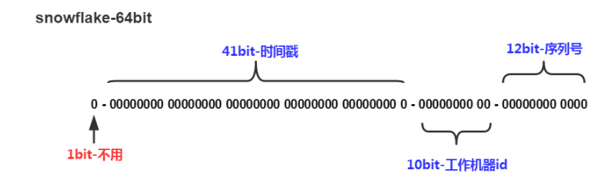

# MybatisPlus

## 一、简介

> 特点

- **无侵入**：只做增强不做改变，引入它不会对现有工程产生影响，如丝般顺滑
- **损耗小**：启动即会自动注入基本 CURD，性能基本无损耗，直接面向对象操作
- **强大的 CRUD 操作**：内置通用 Mapper、通用 Service，仅仅通过少量配置即可实现单表大部分 CRUD 操作，更有强大的条件构造器，满足各类使用需求
- **支持 Lambda 形式调用**：通过 Lambda 表达式，方便的编写各类查询条件，无需再担心字段写错
- **支持主键自动生成**：支持多达 4 种主键策略（内含分布式唯一 ID 生成器 - Sequence），可自由配置，完美解决主键问题
- **支持 ActiveRecord 模式**：支持 ActiveRecord 形式调用，实体类只需继承 Model 类即可进行强大的 CRUD 操作
- **支持自定义全局通用操作**：支持全局通用方法注入（ Write once, use anywhere ）
- **内置代码生成器**：采用代码或者 Maven 插件可快速生成 Mapper 、 Model 、 Service 、 Controller 层代码，支持模板引擎，更有超多自定义配置等您来使用
- **内置分页插件**：基于 MyBatis 物理分页，开发者无需关心具体操作，配置好插件之后，写分页等同于普通 List 查询
- **分页插件支持多种数据库**：支持 MySQL、MariaDB、Oracle、DB2、H2、HSQL、SQLite、Postgre、SQLServer 等多种数据库
- **内置性能分析插件**：可输出 Sql 语句以及其执行时间，建议开发测试时启用该功能，能快速揪出慢查询
- **内置全局拦截插件**：提供全表 delete 、 update 操作智能分析阻断，也可自定义拦截规则，预防误操作

> 为什么说可以不用再写crud代码

`mybatis`是采用接口绑定配置文件的方式来实现对数据库的查询，每个接口对应一个查询，查询结果放在实体类中。而`mybatisPlus`在其基础上再次包装，把对数据库的所有操作包装成一个接口`BaseMapper<T>`，通过泛型来操作不同的实体类。要想使用该类，只需要写一个接口继承该接口，并把要操作的表对应的实体类传入其中。然后通过这个接口操作数据库即可。

## 二、快速入门

> 1. 创建表

```sql
DROP TABLE IF EXISTS user;

CREATE TABLE user
(
	id BIGINT(20) NOT NULL COMMENT '主键ID',
	name VARCHAR(30) NULL DEFAULT NULL COMMENT '姓名',
	age INT(11) NULL DEFAULT NULL COMMENT '年龄',
	email VARCHAR(50) NULL DEFAULT NULL COMMENT '邮箱',
	PRIMARY KEY (id)
);
```

> 2. 插入数据

```sql
DELETE FROM user;

INSERT INTO user (id, name, age, email) VALUES
(1, 'Jone', 18, 'test1@baomidou.com'),
(2, 'Jack', 20, 'test2@baomidou.com'),
(3, 'Tom', 28, 'test3@baomidou.com'),
(4, 'Sandy', 21, 'test4@baomidou.com'),
(5, 'Billie', 24, 'test5@baomidou.com');
```

> 3. 配置依赖

```xml
    <dependencies>
        <!--lombok简化实体类配置-->
        <dependency>
            <groupId>org.projectlombok</groupId>
            <artifactId>lombok</artifactId>
            <version>1.18.18</version>
        </dependency>
        <!--mybatisPlus-->
        <dependency>
            <groupId>com.baomidou</groupId>
            <artifactId>mybatis-plus-boot-starter</artifactId>
            <version>3.0.5</version>
        </dependency>
        <!--springboot-->
        <dependency>
            <groupId>org.springframework.boot</groupId>
            <artifactId>spring-boot-starter-web</artifactId>
        </dependency>
        <!--mysql驱动-->
        <dependency>
            <groupId>mysql</groupId>
            <artifactId>mysql-connector-java</artifactId>
            <scope>runtime</scope>
        </dependency>
        <!--SpringBoot测试模块-->
        <dependency>
            <groupId>org.springframework.boot</groupId>
            <artifactId>spring-boot-starter-test</artifactId>
            <scope>test</scope>
        </dependency>
    </dependencies>
```

`mybatis`和`mybatisPlus`尽量不要同时导入，否则会出现版本问题。`mybatisPlus`是个人研发的，导入它就不用导入`mybatis`。

> 4. 连接数据库

```yml
spring:
  datasource:
    driver-class-name: com.mysql.cj.jdbc.Driver
    username: root
    password: 123456
    url: jdbc:mysql://localhost:3306/study?serverTimezone=GMT%2B8
```

> 5. pojo

```java
package com.mw.pojo;

import lombok.AllArgsConstructor;
import lombok.Data;
import lombok.NoArgsConstructor;

@Data
@AllArgsConstructor
@NoArgsConstructor
public class User {
    private Long id;
    private String name;
    private Integer age;
    private String email;
}
```

> 6. mapper接口

```java
package com.mw.mapper;

import com.baomidou.mybatisplus.core.mapper.BaseMapper;
import com.mw.pojo.User;
import org.springframework.stereotype.Repository;

@Repository
public interface UserMapper extends BaseMapper<User> {

}
```

> 7. ~~传统方式：pojo->dao(配置mybatis，配置mapper.xml)->service->controller~~
>
> 7. 使用了mybatisPlus

- pojo
- mapper接口
- 使用

测试如下：

```java
class MybatisPlusApplicationTests {
	
    @Autowired
    private UserMapper userMapper;
    
    @Test
    void contextLoads() {
        System.out.println(("----- selectAll method test ------"));
        List<User> userList = userMapper.selectList(null);//参数为一个条件构造器
        userList.forEach(System.out::println);
    }
}
```

==注意：需要配置MapperScan（“com.mw.mapper”）==

## 三、配置日志

`mybatisPlus`使用中，sql是不可见的，具体的sql执行是他帮我们做的。我们要想调试的时候，最好能够看见`mybatisPlus`到底如何操作sql，因此开发中开启日志可以提高效率。

```yml
mybatis-plus:
  configuration:
    log-impl: org.apache.ibatis.logging.stdout.StdOutImpl		#配置具体使用什么日志，这里使用了默认的控制台输出
```

## 四、CRUD

### insert

如果插入的数据中没有id，则会自动生成id

```java
@Test
void testInsert(){

    User user = new User();
    user.setAge(3);
    user.setEmail("dsadas@qq.com");
    user.setName("tommy");
    int insert = userMapper.insert(user);
    System.out.println(user.getId());//输出1375106440419184642
}
```

主键生成策略（如何生成id）：

- uuid
- 自增id
- snowflake算法

配置（以自增为例）：

- 实体类字段上 `@TableId(type = IdType.AUTO)`

- 数据库字段上也应该是自增的

当需要别的自增方案时，只需要改注解对应的`type`值

```java
public enum IdType {
    AUTO(0),	//自增
    NONE(1),	//不使用
    INPUT(2),	//手动输入
    ASSIGN_ID(3),//默认全局唯一id
    ASSIGN_UUID(4)//全局唯一id ，uuid
}
```


> snowflake算法

- SnowFlake的结构如下(每部分用-分开): 把时间戳，工作机器id，[序列号](https://www.baidu.com/s?wd=序列号&tn=24004469_oem_dg&rsv_dl=gh_pl_sl_csd)组合在一起。



- 1位标识，由于long基本类型在Java中是带符号的，最高位是符号位，正数是0，负数是1，所以id一般是正数，最高位是0
- 41位时间截(毫秒级)，注意，41位时间截不是存储当前时间的时间截，而是存储时间截的差值（当前时间截 - 开始时间截) 后得到的值，这里的的开始时间截，一般是我们的id生成器开始使用的时间，由我们程序来指定的（如下下面程序IdWorker类的startTime属性）。41位的时间截，可以使用69年，年T = (1L << 41) / (1000L * 60 * 60 * 24 * 365) = 69
- 10位的数据机器位，可以部署在1024个节点，包括10位workerId
- 12位序列，毫秒内的计数，12位的计数顺序号支持每个节点每毫秒(同一机器，同一时间截)产生4096个ID序号
- 加起来刚好64位，为一个Long型。

### update

```java
@Test
void testInsert(){

    User user = new User();
    user.setAge(3);
    user.setName("rick");
    int insert = userMapper.updateById(user);
    System.out.println(insert);

}
```

- 更新语句会根据你该的字段数量不同，而去自动拼接动态sql
- 虽然方法名是byid，但参数是一个对象

### select

```java
//通过id查用户
userMapper.selectById();
//通过多个id查多个用户
userMapper.selectByBatchId(Collection<>);
//条件查询（多个属性要求）
map.put("name","tom");
map.put("email","12@qq.com");
userMapper.selectByMap();
```

### delete

基础如上

> 逻辑删除

**说明:**

只对自动注入的sql起效:

- 插入: 不作限制
- 查找: 追加where条件过滤掉已删除数据,且使用 wrapper.entity 生成的where条件会忽略该字段
- 更新: 追加where条件防止更新到已删除数据,且使用 wrapper.entity 生成的where条件会忽略该字段
- 删除: 转变为 更新

字段类型支持说明:

- 支持所有数据类型(推荐使用 `Integer`,`Boolean`,`LocalDateTime`)
- 如果数据库字段使用`datetime`,逻辑未删除值和已删除值支持配置为字符串`null`,另一个值支持配置为函数来获取值如`now()`

附录:

- 逻辑删除是为了方便数据恢复和保护数据本身价值等等的一种方案，但实际就是删除。
- 如果你需要频繁查出来看就不应使用逻辑删除，而是以一个状态去表示。

**步骤：**

1.  配置`com.baomidou.mybatisplus.core.config.GlobalConfig$DbConfig`

```yml
mybatis-plus:
  global-config:
    db-config:
      logic-delete-field: flag  # 全局逻辑删除的实体字段名(since 3.3.0,配置后可以忽略不配置步骤2)
      logic-delete-value: 1 # 逻辑已删除值(默认为 1)
      logic-not-delete-value: 0 # 逻辑未删除值(默认为 0)
```

2. 步骤2,实体类字段上加上`@TableLogic`注解

```java
@TableLogic
private Integer deleted;
```

**如何 insert ?**

1. 字段在数据库定义默认值(推荐)
2. insert 前自己 set 值
3. 使用自动填充功能


### 自动填充

创建时间，修改时间等属性都应该是自动化完成。

> 方式一：数据库级

设置数据库的该字段为自动更新。

==在开发过程中，一般不让动数据库==

> 方拾二：代码级

1. 在pojo实体类的字段上配置该注解，表示当触发某些条件（update或insert）时，执行字段填充。

```java
@TableField(fill = FieldFill.INSERT)
private Date creatTime;
@TableField(fill = FieldFill.INSERT_UPDATE)
private Date updateTime;
```

```java
public enum FieldFill {
    /**
     * 默认不处理
     */
    DEFAULT,
    /**
     * 插入填充字段
     */
    INSERT,
    /**
     * 更新填充字段
     */
    UPDATE,
    /**
     * 插入和更新填充字段
     */
    INSERT_UPDATE
}
```

2. 编写处理器，处理该注解

```java
@Slf4j
@Component
public class MyMetaObjectHandler implements MetaObjectHandler {

    @Override
    public void insertFill(MetaObject metaObject) {
        log.info("start insert fill ....");
        this.strictInsertFill(metaObject, "createTime", LocalDateTime.class, LocalDateTime.now()); // 起始版本 3.3.0(推荐使用)
        // 或者
        this.strictUpdateFill(metaObject, "createTime", () -> LocalDateTime.now(), LocalDateTime.class); // 起始版本 3.3.3(推荐)
        // 或者
        this.fillStrategy(metaObject, "createTime", LocalDateTime.now()); // 也可以使用(3.3.0 该方法有bug)
    }

    @Override
    public void updateFill(MetaObject metaObject) {
        log.info("start update fill ....");
        this.strictUpdateFill(metaObject, "updateTime", LocalDateTime.class, LocalDateTime.now()); // 起始版本 3.3.0(推荐)
        // 或者
        this.strictUpdateFill(metaObject, "updateTime", () -> LocalDateTime.now(), LocalDateTime.class); // 起始版本 3.3.3(推荐)
        // 或者
        this.fillStrategy(metaObject, "updateTime", LocalDateTime.now()); // 也可以使用(3.3.0 该方法有bug)
    }
}
```

注意事项：

- 填充原理是直接给`entity`的属性设置值!!!
- 注解则是指定该属性在对应情况下必有值,如果无值则入库会是`null`
- `MetaObjectHandler`提供的默认方法的策略均为:如果属性有值则不覆盖,如果填充值为`null`则不填充
- 字段必须声明`TableField`注解,属性`fill`选择对应策略,该声明告知`Mybatis-Plus`需要预留注入`SQL`字段
- 填充处理器`MyMetaObjectHandler`在 Spring Boot 中需要声明`@Component`或`@Bean`注入
- 要想根据注解`FieldFill.xxx`和`字段名`以及`字段类型`来区分必须使用父类的`strictInsertFill`或者`strictUpdateFill`方法
- 不需要根据任何来区分可以使用父类的`fillStrategy`方法


## 五、插件

### 插件主体

目前已有的功能:

- 自动分页: PaginationInnerInterceptor
- 多租户: TenantLineInnerInterceptor
- 动态表名: DynamicTableNameInnerInterceptor
- 乐观锁: OptimisticLockerInnerInterceptor
- sql性能规范: IllegalSQLInnerInterceptor
- 防止全表更新与删除: BlockAttackInnerInterceptor

==注意:==

使用多个功能需要注意顺序关系,建议使用如下顺序

- 多租户,动态表名
- 分页,乐观锁
- sql性能规范,防止全表更新与删除

总结: 对sql进行单次改造的优先放入,不对sql进行改造的最后放入

==举例：以分页插件为例==

**springboot配置方式**

```java
@Configuration
@MapperScan("scan.your.mapper.package")
public class MybatisPlusConfig {

    /**
     * 新的分页插件,一缓和二缓遵循mybatis的规则,需要设置 MybatisConfiguration#useDeprecatedExecutor = false 避免缓存出现问题(该属性会在旧插件移除后一同移除)
     */
    @Bean
    public MybatisPlusInterceptor mybatisPlusInterceptor() {
        MybatisPlusInterceptor interceptor = new MybatisPlusInterceptor();
        interceptor.addInnerInterceptor(new PaginationInnerInterceptor(DbType.H2));//如果要配置其他功能，将其实例添加进去即可
        return interceptor;
    }

//    @Bean
//    public ConfigurationCustomizer configurationCustomizer() {
//        return configuration -> configuration.setUseDeprecatedExecutor(false);
//    }
}
```

### 乐观锁

> 乐观锁：总是认为不会出现问题，无论干什么都不去上锁。如果出现问题，再次更新值
>
> 悲观锁：总是认为会出现问题，无论干什么都要上锁，再去操作。

- 取出记录时，获取当前version
- 更新时，带上这个version
- 执行更新时， set version = newVersion where version = oldVersion
- 如果version不对，就更新失败

> 步骤

1. 数据库中添加`version`属性
2. 实体类上添加`version`字段和`@Version`注解

```java
@Version
private Integer version;
```

3. 配置乐观锁插件（如上）

==说明:==

- **支持的数据类型只有:int,Integer,long,Long,Date,Timestamp,LocalDateTime**
- 整数类型下 `newVersion = oldVersion + 1`
- `newVersion` 会回写到 `entity` 中
- 仅支持 `updateById(id)` 与 `update(entity, wrapper)` 方法
- **在 `update(entity, wrapper)` 方法下, `wrapper` 不能复用!!!**

### 分页插件

1. 配置插件
2. 直接使用page对象

```java
Page<User> page = new Page<>(1, 5);//设置当前页和页面大小
userMapper.selectPage(page, null);//按照页面规格进行查询
```

## 六、条件构造器

```java
QueryWrapper<User> wrapper = new QueryWrapper<>();
wrapper.isNotNull("name")	//用方法来实现动态sql
    	.ge("age",3);		//可以链式调用
userMapper.selectList(wrapper);//调用时只需要把设置好的条件构造器传进去
```

## 七、代码生成器

[官方配置模板](https://mp.baomidou.com/guide/generator.html)


