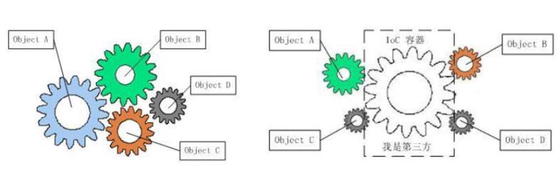
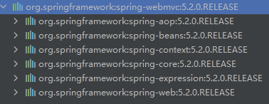
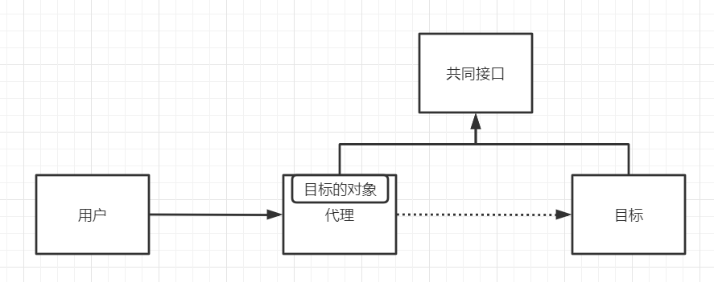
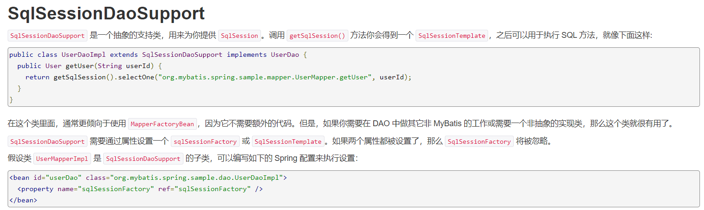

# Spring5

## 一、IOC理论

### 理论原型

IOC即控制反转，就是把控制权交给用户，而不是程序员来选择。

先来看一种思想：

Dao接口：

```java
package com.mw.dao;

public interface UserDao {
    public void geUser();
}

```

Dao实现类：

```java
package com.mw.dao;

public class UserDaoImp implements UserDao{
        public void geUser() {
        System.out.println("获得用户");
    }
}

```

Service接口：

```java
package com.mw.Service;

public interface UserService {
    public void getUser();
}
```

Service实现类：

```java
package com.mw.Service;

import com.mw.dao.UserDao;
import com.mw.dao.UserDaoImp;

public class UserServiceImp implements UserService{

    UserDao userDao=new UserDaoImp();

    @Override
    public void getUser() {
        userDao.geUser();
    }
}
```

重点看这个实现类，业务层要想调用dao层，必须要拿到它的对象才能操作，但是这样就把代码写死在了程序中，耦合性高，不符合==开闭原则==。当我们要使用UserDao的其他实现时，还得改变service层的源代码。因此可以想到用`setDao()`方法进行注入，把选择权交给客户端，从而让程序员能够专心于扩展而不是修改。修改代码如下：

```java
package com.mw.Service;

import com.mw.dao.UserDao;
import com.mw.dao.UserDaoImp;

public class UserServiceImp implements UserService{

    UserDao userDao;

    public void setUserDao(UserDao userDao) {
        this.userDao = userDao;
    }

    @Override
    public void getUser() {
        userDao.geUser();
    }
}
```

spring自动注入的思想就是依靠set方法来实现的。这就是IOC的一个原型。控制反转在这里就指让用户指定用哪个UserDao的实现类，而不是程序员控制到底用哪个，从而降低了两个类之间的耦合。

这个例子主要是用来告诉大家，对象不自己创建，而是让第三方创建完再交给自己使用可以解耦。

### IOC本质

控制反转IOC（Inversion of Control），是一种设计思想，DI（依赖注入）是实现IoC的一种方法。在没有IoC的程序中，我们使用面向对象编程，对象的创建于对象间的依赖关系完全硬编码在程序中，对象的创建由程序自己控制，控制反转后将对象的创建转移给第三方，也就是获得依赖对象的方式反转了。



## 二、Spring的IoC配置

在maven中构建工程：

```xml
<dependency>
    <groupId>org.springframework</groupId>
    <artifactId>spring-webmvc</artifactId>
    <version>5.2.0.RELEASE</version>
</dependency>
```

这个依赖可以帮我们导入其他常用的依赖，示例如下：



在spring中可以设置类的对象由IoC容器统一管理。使用Spring来创建对象，在Spring中，这些都称为bean。

```xml
<?xml version="1.0" encoding="UTF-8"?>
<beans xmlns="http://www.springframework.org/schema/beans"
    xmlns:xsi="http://www.w3.org/2001/XMLSchema-instance"
    xsi:schemaLocation="http://www.springframework.org/schema/beans
        https://www.springframework.org/schema/beans/spring-beans.xsd">

    <!--id相当于的是对象名，class指的是类名-->
    <bean id="hello" class="com.mw.Hello">
        <!--name指的是set方法名去掉'set'后首字母小写，value指的是主动设置的值（静态赋值：简单类型和String）-->
        <property name="..." value="..."/>
        <!--name指的是set方法名去掉'set'后首字母小写，ref是指的spring接管的bean的id（动态赋值）-->
        <property name="..." ref="..."/>
    </bean>

    <bean id="..." class="...">
        <!-- collaborators and configuration for this bean go here -->
    </bean>

    <!-- more bean definitions go here -->

</beans>

```

设置完配置文件后就可以让Spring读取改配置文件，从而让容器接管这些类从而生成对象。

```java
//获取Spring的上下文对象
ApplicationContext context = new ClassPathXmlApplicationContext("services.xml", "daos.xml");//可以读取多个配置文件
```

如果想拿到容器创建的对象只需要：

```java
Hello hello=(Hello)context.getBean("hello");

//如果不想强转类型，可以在参数中声明
Hello hello=context.getBean("hello",Hello.class);
```

这样就拿到了Spring给创建的对象。但是我们发现整个过程并没有去new一个对象。这是因为Spring通过<bean>标签已经获得了创建对象的所有内容。包括：对象名，类全限定名，属性值。然后通过反射的方式创建该对象。

对应上边理论原型中的例子，这一步就是Spring作为第三方创建对象的过程，创建完毕后交给程序进行使用。比如：

把UserDaoImp，UserServiceImp都注册为bean（注意service的dao属性要有set方法，且用ref指向注册的dao的bean），客户直接通过容器获得UserServiceImp对象使用。

==注意：==

- 依赖注入的本质是使用set方法进行注入的，即bean的所有属性都是依靠set方法注入的，如果没有set方法就无法注入。
- 控制反转的本质是程序不主动创建对象，而是被动的接收对象。
- IoC是一种思想，由主动编程编程被动接受

## 三、IOC创建对象的方式

1. 默认使用无参构造创建bean，然后通过set方法给property标签内指定的属性赋值

2. 也可以通过有参构造创建对象

   1. 通过构造器形参下标创建对象

      ```xml
      <bean id="user" class="com.mw.pojo.User">
          <!--index:第几个形参-->
          <constructor-arg index="0" value="tom"/>
      </bean>
      ```

   2. 通过构造器类型名创建对象，但如果多个参数同类型就不能使用（不建议使用）

      ```xml
      <bean id="user" class="com.mw.pojo.User">
          <!--type形参的全限定名-->
          <constructor-arg type="java.lang.String" value="tom"/>
      </bean>
      ```

   3. 通过构造器参数名创建对象（推荐）

      ```xml
      <bean id="user" class="com.mw.pojo.User">
          <!--type形参的全限定名-->
          <constructor-arg type="java.lang.String" value="tom"/>
      </bean>
      ```

## 四、Spring配置

### Alias

设置别名后，用原名字和别名都能取出对应的bean

```xml
<alias name="user" alias="yonghu"/>
```

别名存在的意义是在不同的使用场景使用不同的名字。

同个Bean无法使用多个id所以有了别名。

### Bean配置

这里的name指的也是别名，且可以取多个别名

```xml
<bean id="user" class="com.mw.pojo.User" name="yonghu,newUser u2"><!--可以用逗号、空格或者分号进行区分-->
```

### Import

用于团队开发，可以将多个配置文件导入成一个。

比如每个人有自己的beans*.xml，最后只需要在总的applicationContext.xml中导入每个人的xml文件即可使用，加载配置文件时只需要加载这一个总的配置文件即可。例如：

```xml
<import resource="beans1.xml"/>
```

但是如果bean同名，后读取的会覆盖前边的。

## 五、依赖注入

### 构造器注入（见上文）

### Set方式注入

- 依赖注入：Set注入！
  - 依赖：Bean对象的创建依赖于容器
  - 注入：Bean对象中的所有属性，通过容器注入

```java
 package com.mw.pojo;

public class Address {
 
     private String address;
 
     public String getAddress() {
         return address;
    }
 
     public void setAddress(String address) {
         this.address = address;
    }
 }
```

```java
 package com.mw.pojo;
 
 import java.util.List;
 import java.util.Map;
 import java.util.Properties;
 import java.util.Set;
 
 public class Student {
 
     private String name;
     private Address address;
     private String[] books;
     private List<String> hobbys;
     private Map<String,String> card;
     private Set<String> games;
     private String wife;
     private Properties info;
 
/*	这里是get，set方法*/
 
     public void show(){
         System.out.println("name="+ name
                 + ",address="+ address.getAddress()
                 + ",books="
        );
         for (String book:books){
             System.out.print("<<"+book+">>\t");
        }
         System.out.println("\n爱好:"+hobbys);
 
         System.out.println("card:"+card);
 
         System.out.println("games:"+games);
 
         System.out.println("wife:"+wife);
 
         System.out.println("info:"+info);
 
    }
 }
```

1. 常量注入

```xml
<bean id="student" class="com.mw.pojo.Student">
     <property name="name" value="小明"/>
 </bean>
```

2. Bean注入

```xml
 <bean id="addr" class="com.mw.pojo.Address">
     <property name="address" value="重庆"/>
 </bean>
 
 <bean id="student" class="com.mw.pojo.Student">
     <property name="name" value="小明"/>
     <property name="address" ref="addr"/>
 </bean>
```

3、**数组注入**

```xml
 <bean id="student" class="com.mw.pojo.Student">
     <property name="name" value="小明"/>
     <property name="address" ref="addr"/>
     <property name="books">
         <array>
             <value>西游记</value>
             <value>红楼梦</value>
             <value>水浒传</value>
         </array>
     </property>
 </bean>
```

4、**List注入**

```xml
 <property name="hobbys">
     <list>
         <value>听歌</value>
         <value>看电影</value>
         <value>爬山</value>
     </list>
 </property>
```

5、**Map注入**

```xml
 <property name="card">
     <map>
         <entry key="中国邮政" value="456456456465456"/>
         <entry key="建设" value="1456682255511"/>
     </map>
 </property>
```

6、**set注入**

```xml
 <property name="games">
     <set>
         <value>LOL</value>
         <value>BOB</value>
         <value>COC</value>
     </set>
 </property>
```

7、**Null注入**

```xml
 <property name="wife">
     <null/>
</property>
```

8、**Properties注入**

类似于map，也是一种键值的关系。

```xml
 <property name="info">
     <props>
         <prop key="学号">20190604</prop>
         <prop key="性别">男</prop>
         <prop key="姓名">小明</prop>
     </props>
 </property>
```

###扩展方式注入

1. P命名空间注入（对应set注入）

User.java ：【注意：这里没有有参构造器！】

```java
 public class User {
     private String name;
     private int age;
 
     public void setName(String name) {
         this.name = name;
    }
 
     public void setAge(int age) {
         this.age = age;
    }
 }
```

需要在头文件中加入约束文件：`xmlns:p="http://www.springframework.org/schema/p"`

```xml
 <!--P(属性: properties)命名空间 , 属性依然要设置set方法-->
 <bean id="user" class="com.kuang.pojo.User" p:name="mw" p:age="18"/>
```

2. C命名空间注入

User.java ：【注意：这里只有有参构造器，没有set方法】

```java
 public class User {
     private String name;
     private int age;
 
     public User(String name,int age) {
         this.name = name;
         this.age = age;
    }
 }
```

需要在头文件中加入约束文件：`xmlns:c="http://www.springframework.org/schema/c"`

```xml
<!--C(构造: Constructor)命名空间 , 属性依然要设置set方法-->
 <bean id="user" class="com.kuang.pojo.User" c:name="mw" c:age="18"/>
```

### Bean的作用域

1. 单例模式：整个容器中只有一个对象的实例。

```xml
<bean id="user" class="com.kuang.pojo.User" scope="singleton"/>
```

2. 原型模式：每次从容器中get，都会产生一个新对象。

```xml
<bean id="user" class="com.kuang.pojo.User" scope="prototype"/>
```

3. 其余的request，session，application只能在web开发中使用到。

## 六、Bean的自动装配

看下边这个配置文件：

```xml
   <bean id="cat" class="com.kuang.pojo.Cat"/>

   <bean id="user" class="com.kuang.pojo.User">
       <property name="cat" ref="cat"/>
       <property name="str" value="qinjiang"/>
   </bean>
</beans>
```

在加载完第一个bean后，容器中就已经有了一个叫做cat的对象，这时我们在people对象中又显示的配了一个名叫cat的属性，引用上边那个id为cat的对象。这样就显得十分重复，我们有了属性名，且如果与对象重名时，便可以自动做出对应。所以就有了自动装配。

### 在配置文件中自动装配

> - byName

```xml
 <bean id="cat" class="com.kuang.pojo.Cat"/>
 
<bean id="user" class="com.kuang.pojo.User" autowire="byName">
     <property name="str" value="qinjiang"/>
 </bean>
```

当一个bean节点带有 autowire byName的属性时。

1. 将查找其类中所有的set方法名，例如setCat，获得将set去掉并且首字母小写的字符串，即cat。
2. 去spring容器中寻找是否有此字符串名称id的对象。
3. 如果有，就取出注入；如果没有，就报空指针异常。

> - byType

根据该字段的类型，向容器中找该类型的实例化对象。使用autowire byType首先需要保证：同一类型的对象，在spring容器中唯一。如果不唯一，会报不唯一的异常。

```xml
 <bean id="cat" class="com.kuang.pojo.Cat"/>
 
<bean id="user" class="com.kuang.pojo.User" autowire="byType">
     <property name="str" value="qinjiang"/>
 </bean>
```

==错误：当容器中有一个类型的两个对象时==

```xml
<bean id="cat1" class="com.kuang.pojo.Cat"/>
<bean id="cat2" class="com.kuang.pojo.Cat"/>
<!--报错-->
<bean id="user" class="com.kuang.pojo.User" autowire="byType">
   <property name="str" value="qinjiang"/>
</bean>
```

### 使用注解进行自动装配

==准备工作：==

1、在spring配置文件中引入context文件头

```xml
xmlns:context="http://www.springframework.org/schema/context"

http://www.springframework.org/schema/context
http://www.springframework.org/schema/context/spring-context.xsd
```

2、开启属性注解支持！

```xml
<context:annotation-config/>
```

#### @Autowired

- @Autowired的装配方式：
  - 该类型只有一个就返回该对象
  - 同类型有多个对象，按名字返回（如果找到多个类型匹配，但是没有名字匹配，那么可以用`@Qualifier(value="name")`进行指定）
  - 都找不到报空指针异常
- 需要导入 spring-aop的包！


1. 在要注入的属性上标注@Autowired，可以实现自动装配。

```java
public class User {
   @Autowired
   private Cat cat;
   @Autowired
   private Dog dog;
   private String str;

   public Cat getCat() {
       return cat;
  }
   public Dog getDog() {
       return dog;
  }
   public String getStr() {
       return str;
  }
}
```

2、此时配置文件内容

```xml
<context:annotation-config/>

<bean id="dog" class="com.kuang.pojo.Dog"/>
<bean id="cat" class="com.kuang.pojo.Cat"/>
<bean id="user" class="com.kuang.pojo.User"/>
```

使用@Autowired后，实体类中可以不写set方法。这是因为注解和xml文件的反射机制不同

- 注解是反射直接给属性赋值
- xml是反射获得set方法赋值


@Autowired(required=false)  说明：false，对象可以为null；true，对象必须存对象，不能为null。

```java
//如果允许对象为null，设置required = false,默认为true
@Autowired(required = false)
private Cat cat;
```

#### @Qualifier

- 从匹配的多个对象中指定一个具体的对象
- @Qualifier不能单独使用。

测试实验步骤：

1、配置文件修改内容，保证类型存在对象。且名字不为类的默认名字！

```xml
<bean id="dog1" class="com.kuang.pojo.Dog"/>
<bean id="dog2" class="com.kuang.pojo.Dog"/>
<bean id="cat1" class="com.kuang.pojo.Cat"/>
<bean id="cat2" class="com.kuang.pojo.Cat"/>
```

2、没有加Qualifier测试，直接报错

3、在属性上添加Qualifier注解

```java
@Autowired
@Qualifier(value = "cat2")
private Cat cat;
@Autowired
@Qualifier(value = "dog2")
private Dog dog;
```

测试，成功输出！

#### @Resource

这是java提供的方法。

- @Resource如有指定的name属性，先按该属性进行byName方式查找装配；
- 其次再进行默认的byName方式进行装配；
- 如果以上都不成功，则按byType的方式自动装配。
- 都不成功，则报异常。

#### 小结

@Autowired与@Resource异同：

1、@Autowired与@Resource都可以用来装配bean。都可以写在字段上，或写在setter方法上。

2、@Autowired默认按类型装配（属于spring规范），默认情况下必须要求依赖对象必须存在，如果要允许null 值，可以设置它的required属性为false，如：@Autowired(required=false) ，如果我们想使用名称装配可以结合@Qualifier注解进行使用

3、@Resource（属于J2EE规范），默认按照名称进行装配，名称可以通过name属性进行指定。如果没有指定name属性，当注解写在字段上时，默认取字段名进行按照名称查找，如果注解写在setter方法上默认取属性名进行装配。当找不到与名称匹配的bean时才按照类型进行装配。但是需要注意的是，如果name属性一旦指定，就只会按照名称进行装配。

它们的作用相同都是用注解方式注入对象，但执行顺序不同。@Autowired先byType，@Resource先byName。

## 七、使用注解进行开发

在spring4之后，想要使用注解形式，必须得要引入aop的包。

在配置文件当中，还得要引入一个context约束

```xml
<?xml version="1.0" encoding="UTF-8"?>
<beans xmlns="http://www.springframework.org/schema/beans"
      xmlns:xsi="http://www.w3.org/2001/XMLSchema-instance"
      xmlns:context="http://www.springframework.org/schema/context"
      xsi:schemaLocation="http://www.springframework.org/schema/beans
       http://www.springframework.org/schema/beans/spring-beans.xsd
       http://www.springframework.org/schema/context
       http://www.springframework.org/schema/context/spring-context.xsd">
	<!--指定要扫描的包，这个包下的注解将会生效-->
    <context:component-scan base-package="com.mw.pojo"/>
    <!--激活那些已经在spring容器里注册过的bean上面的注解，也就是显示的向Spring注册-->
    <context:annotation-config/>
    
</beans>
```

### Bean实现

```java
@Component("user")//不指定value的话默认使用类名首字母小写作为bean的值
// 相当于配置文件中 <bean id="user" class="当前注解的类"/>
public class User {
   public String name = "mw";
}
```

### 属性注入

使用注解注入属性

1、可以不用提供set方法，直接在直接名上添加@value("值")

```java
@Component("user")
// 相当于配置文件中 <bean id="user" class="当前注解的类"/>
public class User {
   @Value("mw")
   // 相当于配置文件中 <property name="name" value="mw"/>
   public String name;
}
```

2、如果提供了set方法，在set方法上添加@value("值");

```java
@Component("user")
public class User {

   public String name;

   @Value("mw")
   public void setName(String name) {
       this.name = name;
  }
}
```

### 衍生注解

为了更好的进行分层，Spring可以使用其它三个注解，功能一样，目前使用哪一个功能都一样。

- @Controller：web层
- @Service：service层
- @Repository：dao层

写上这些注解，就相当于将这个类交给Spring管理装配了！

==注意：要使他们被Spring扫描到==

### 作用域

@Scope标注在类上，将该类的实例化对象交给Spring管理

- singleton：默认的，Spring会采用单例模式创建这个对象。关闭工厂 ，所有的对象都会销毁。
- prototype：多例模式。关闭工厂 ，所有的对象不会销毁。内部的垃圾回收机制会回收

### 小结

**XML与注解比较**

- XML可以适用任何场景 ，结构清晰，维护方便
- 注解不是自己提供的类使用不了，开发简单方便

**xml与注解整合开发** ：推荐最佳实践

- xml管理Bean
- 注解完成属性注入
- 使用过程中， 可以不用扫描，扫描是为了类上的注解

## 八、使用Java的方式配置Spring

使用@Configuration声明配置类时有两种方法来生成Bean：

**一、在配置类中定义一个方法，并用@Bean注解声明（如下）**

JavaConfig 原来是 Spring 的一个子项目，它通过 Java 类的方式提供 Bean 的定义信息，在 Spring4 的版本， JavaConfig 已正式成为 Spring4 的核心功能 。

测试：

1、编写一个实体类，Dog

```java
public class Dog {
   public String name = "dog";
}
```

2、新建一个config配置包，编写一个MyConfig配置类

```java
@Configuration  //代表这是一个配置类
public class MyConfig {

   @Bean //通过方法注册一个bean，这里的返回值就Bean的类型，方法名就是bean的id！
   public Dog dog(){
       return new Dog();
  }

}
```

3、测试

```java
@Test
public void test2(){
   ApplicationContext applicationContext =
           new AnnotationConfigApplicationContext(MyConfig.class);
   Dog dog = (Dog) applicationContext.getBean("dog");
   System.out.println(dog.name);
}
```

**二、在User类上使用@Component注解，并在配置类上声明@ComponentScan("User的类路径")，这样就会自动扫描@Component并生成Bean**

```java
@Component  //将这个类标注为Spring的一个组件，放到容器中！
public class Dog {
   public String name = "dog";
}
```

```java
@Configuration  //代表这是一个配置类
@ComponentScan("com.mw.pojo")
public class MyConfig {

}
```

==注意：==

- 自己写的类，直接扫描即可。@Bean一般用来第三方类的自动注入，比如数据源
- 在这个例子中，实体类不加上@Component也能在容器中生成Bean，因为配置了`@ComponentScan`

### 导入其他配置类

1、我们再编写一个配置类！

```java
@Configuration  //代表这是一个配置类
public class MyConfig2 {
}
```

2、在之前的配置类中我们来选择导入这个配置类

```java
@Configuration
@Import(MyConfig2.class)  //导入合并其他配置类，类似于配置文件中的 inculde 标签
public class MyConfig {

   @Bean
   public Dog dog(){
       return new Dog();
  }

}
```

## 九、代理模式

代理和目标继承同一个接口，代理持有目标的对象，用户直接对代理进行操作。

这样的话，可以让代理提供除目标对象外的其他功能。



### 静态代理

角色：

- 抽象角色 : 一般使用接口或者抽象类来实现
- 真实角色 : 被代理的角色
- 代理角色 : 代理真实角色 。代理真实角色后 , 一般会做一些附属的操作 .
- 客户  :  使用代理角色来进行一些操作 

**静态代理的好处:**

- 可以使得我们的真实角色更加纯粹 . 不再去关注一些公共的事情 .
- 公共的业务由代理来完成 . 实现了业务的分工 ,
- 公共业务发生扩展时变得更加集中和方便 .

缺点 :

- 类多了 , 多了代理类 , 工作量变大了 . 开发效率降低 .

我们想要静态代理的好处，又不想要静态代理的缺点，所以 , 就有了动态代理 !

### 动态代理

**代码实现** 

抽象角色和真实角色和之前的一样！

Rent . java 即抽象角色

```java
//抽象角色：租房
public interface Rent {
   public void rent();
}
```

Host . java 即真实角色

```java
//真实角色: 房东，房东要出租房子
public class Host implements Rent{
   public void rent() {
       System.out.println("房屋出租");
  }
}
```

ProxyInvocationHandler. java 即代理角色

```java
public class ProxyInvocationHandler implements InvocationHandler {
   private Rent rent;

   public void setRent(Rent rent) {
       this.rent = rent;
  }

   //生成代理类，重点是第二个参数，获取要代理的抽象角色！之前都是一个角色，现在可以代理一类角色
   public Object getProxy(){
       return Proxy.newProxyInstance(this.getClass().getClassLoader(),
                                     rent.getClass().getInterfaces(),
                                     this);
  }

    /*
    1.Proxy.newProxyInstance()是为了创建一个代理类的实例，代理类是动态生成的，它的参数包括了要生成该对象的所有条件。
    2.也许看起来没有调用本类的invoke()方法（如下），但是在Proxy.newProxyInstance方法中一定使用了该方法。因为他的最后一个参数为这个对象本身，通过反射肯定能得到invoke方法。生成的代理对象肯定会调用invoke方法
    3.调用真实角色的某一方法，就是用invoke方法用反射的方式来调用该方法。
     */
    
   // proxy : 代理类 
   //method : 代理类的调用处理程序的方法对象.
   // 处理代理实例上的方法调用并返回结果
   @Override
   public Object invoke(Object proxy, Method method, Object[] args) throws Throwable {
       seeHouse();
       //核心：本质利用反射实现！
       Object result = method.invoke(rent, args);
       fare();
       return result;
  }

   //看房
   public void seeHouse(){
       System.out.println("带房客看房");
  }
   //收中介费
   public void fare(){
       System.out.println("收中介费");
  }

}
```

Client . java

```java
//租客
public class Client {

   public static void main(String[] args) {
       //真实角色
       Host host = new Host();
       //代理实例的调用处理程序
       ProxyInvocationHandler pih = new ProxyInvocationHandler();
       pih.setRent(host); //将真实角色放置进去！
       Rent proxy = (Rent)pih.getProxy(); //动态生成对应的代理类！
       proxy.rent();
  }

}
```

proxy.rent();调用步骤猜测：

1. 调用代理对象的rent方法
2. 代理对象调用invoke方法

**核心：**一个动态代理 , 一般代理某一类业务 , 一个动态代理可以代理多个类，代理的是接口！

==动态代理的好处：==

静态代理有的它都有，静态代理没有的，它也有！

- 可以使得我们的真实角色更加纯粹 . 不再去关注一些公共的事情 .
- 公共的业务由代理来完成 . 实现了业务的分工 ,
- 公共业务发生扩展时变得更加集中和方便 .
- 一个动态代理 , 一般代理某一类业务
- 一个动态代理可以代理多个类，代理的是接口！

## 十、AOP

使用AOP织入，需要导入一个依赖包！

```xml
<!-- https://mvnrepository.com/artifact/org.aspectj/aspectjweaver -->
<dependency>
   <groupId>org.aspectj</groupId>
   <artifactId>aspectjweaver</artifactId>
   <version>1.9.4</version>
</dependency>
```

### 通过 Spring API 实现

首先编写我们的业务接口和实现类

```java
public interface UserService {

   public void add();

   public void delete();

   public void update();

   public void search();

}
public class UserServiceImpl implements UserService{

   @Override
   public void add() {
       System.out.println("增加用户");
  }

   @Override
   public void delete() {
       System.out.println("删除用户");
  }

   @Override
   public void update() {
       System.out.println("更新用户");
  }

   @Override
   public void search() {
       System.out.println("查询用户");
  }
}
```

然后去写我们的增强类 , 我们编写两个 , 一个前置增强 一个后置增强

实现的接口不同，执行的时间不同

```java
public class BeforeLog implements MethodBeforeAdvice {

   //method : 要执行的目标对象的方法
   //objects : 被调用的方法的参数
   //Object : 目标对象
   @Override
   public void before(Method method, Object[] objects, Object o) throws Throwable {
       System.out.println( o.getClass().getName() + "的" + method.getName() + "方法被执行了");
  }
}
public class AfterLog implements AfterReturningAdvice {
   //returnValue 返回值
   //method被调用的方法
   //args 被调用的方法的对象的参数
   //target 被调用的目标对象
   @Override
   public void afterReturning(Object returnValue, Method method, Object[] args, Object target) throws Throwable {
       System.out.println("执行了" + target.getClass().getName()
       +"的"+method.getName()+"方法,"
       +"返回值："+returnValue);
  }
}
```

最后去spring的文件中注册 , 并实现aop切入实现 , 注意导入约束 .

```xml
<?xml version="1.0" encoding="UTF-8"?>
<beans xmlns="http://www.springframework.org/schema/beans"
      xmlns:xsi="http://www.w3.org/2001/XMLSchema-instance"
      xmlns:aop="http://www.springframework.org/schema/aop"
      xsi:schemaLocation="http://www.springframework.org/schema/beans
       http://www.springframework.org/schema/beans/spring-beans.xsd
       http://www.springframework.org/schema/aop
       http://www.springframework.org/schema/aop/spring-aop.xsd">

   <!--注册bean-->
   <bean id="userService" class="com.kuang.service.UserServiceImpl"/>
   <bean id="beforeLog" class="com.kuang.log.BeforeLog"/>
   <bean id="afterLog" class="com.kuang.log.AfterLog"/>

   <!--aop的配置-->
   <aop:config>
       <!--切入点 expression:表达式匹配要执行的方法execution(* * * * *)-->
       <!--修饰词(可以不写，默认public) 返回值 类名 方法名 参数--><!--*代表任何一个参数，(..)代表所有参数-->
       <aop:pointcut id="pointcut" expression="execution(* com.kuang.service.UserServiceImpl.*(..))"/>
       <!--执行环绕; advice-ref执行方法 . pointcut-ref切入点-->
       <aop:advisor advice-ref="beforeLog" pointcut-ref="pointcut"/>
       <aop:advisor advice-ref="afterLog" pointcut-ref="pointcut"/>
   </aop:config>

</beans>
```

测试

```java
public class MyTest {
   @Test
   public void test(){
       ApplicationContext context = new ClassPathXmlApplicationContext("beans.xml");
       UserService userService = (UserService) context.getBean("userService");
       userService.search();
  }
}
```

### 自定义类来实现Aop

目标业务类不变依旧是userServiceImpl

第一步 : 写我们自己的一个切入类

```java
public class DiyPointcut {

   public void before(){
       System.out.println("---------方法执行前---------");
  }
   public void after(){
       System.out.println("---------方法执行后---------");
  }
   
}
```

去spring中配置

```xml
<!--第二种方式自定义实现-->
<!--注册bean-->
<bean id="diy" class="com.kuang.config.DiyPointcut"/>

<!--aop的配置-->
<aop:config>
   <!--第二种方式：使用AOP的标签实现-->
   <aop:aspect ref="diy">
       <aop:pointcut id="diyPonitcut" expression="execution(* com.kuang.service.UserServiceImpl.*(..))"/>
       <aop:before pointcut-ref="diyPonitcut" method="before"/>
       <aop:after pointcut-ref="diyPonitcut" method="after"/>
   </aop:aspect>
</aop:config>
```

### 使用注解实现

第一步：编写一个注解实现的增强类

```java
package com.kuang.config;

import org.aspectj.lang.ProceedingJoinPoint;
import org.aspectj.lang.annotation.After;
import org.aspectj.lang.annotation.Around;
import org.aspectj.lang.annotation.Aspect;
import org.aspectj.lang.annotation.Before;

@Aspect
public class AnnotationPointcut {
   @Before("execution(* com.kuang.service.UserServiceImpl.*(..))")
   public void before(){
       System.out.println("---------方法执行前---------");
  }

   @After("execution(* com.kuang.service.UserServiceImpl.*(..))")
   public void after(){
       System.out.println("---------方法执行后---------");
  }

   @Around("execution(* com.kuang.service.UserServiceImpl.*(..))")
   public void around(ProceedingJoinPoint jp) throws Throwable {//ProceedingJoinPoint可以拿到切入点的一些东西
       System.out.println("环绕前");
       //执行目标方法proceed
       Object proceed = jp.proceed();
       System.out.println("环绕后");
       
//       System.out.println("签名:"+jp.getSignature());
//       System.out.println(proceed);
  }
}
/*
输出结果：
环绕前
---------方法执行前---------
方法执行
环绕后
---------方法执行后---------
*/
//有的弹幕说最后两句输出反过来
```


第二步：在Spring配置文件中，注册bean，并增加支持注解的配置

```xml
<!--第三种方式:注解实现-->
<bean id="annotationPointcut" class="com.kuang.config.AnnotationPointcut"/><!--也可以直接@component注入-->
<aop:aspectj-autoproxy/>
```

aop:aspectj-autoproxy：说明

```xml
通过aop命名空间的<aop:aspectj-autoproxy />声明自动为spring容器中那些配置@aspectJ切面的bean创建代理，织入切面。当然，spring 在内部依旧采用AnnotationAwareAspectJAutoProxyCreator进行自动代理的创建工作，但具体实现的细节已经被<aop:aspectj-autoproxy />隐藏起来了

<aop:aspectj-autoproxy />有一个proxy-target-class属性，默认为false，表示使用jdk动态代理织入增强，当配为<aop:aspectj-autoproxy  poxy-target-class="true"/>时，表示使用CGLib动态代理技术织入增强。不过即使proxy-target-class设置为false，如果目标类没有声明接口，则spring将自动使用CGLib动态代理。
```

## 十一、整合Mybatis

### 导入相关jar包

junit

```xml
<dependency>
   <groupId>junit</groupId>
   <artifactId>junit</artifactId>
   <version>4.12</version>
</dependency>
```

mybatis

```xml
<dependency>
   <groupId>org.mybatis</groupId>
   <artifactId>mybatis</artifactId>
   <version>3.5.2</version>
</dependency>
```

mysql-connector-java

```xml
<dependency>
   <groupId>mysql</groupId>
   <artifactId>mysql-connector-java</artifactId>
   <version>5.1.47</version>
</dependency>
```

spring相关

```xml
<dependency>
   <groupId>org.springframework</groupId>
   <artifactId>spring-webmvc</artifactId>
   <version>5.1.10.RELEASE</version>
</dependency>
<dependency>
   <groupId>org.springframework</groupId>
   <artifactId>spring-jdbc</artifactId>
   <version>5.1.10.RELEASE</version>
</dependency>
```

aspectJ AOP 织入器

```xml
<!-- https://mvnrepository.com/artifact/org.aspectj/aspectjweaver -->
<dependency>
   <groupId>org.aspectj</groupId>
   <artifactId>aspectjweaver</artifactId>
   <version>1.9.4</version>
</dependency>
```

mybatis-spring整合包 【重点】

```xml
<dependency>
   <groupId>org.mybatis</groupId>
   <artifactId>mybatis-spring</artifactId>
   <version>2.0.2</version>
</dependency>
```

配置Maven静态资源过滤问题！

```xml
<build>
   <resources>
       <resource>
           <directory>src/main/java</directory>
           <includes>
               <include>**/*.properties</include>
               <include>**/*.xml</include>
           </includes>
           <filtering>true</filtering>
       </resource>
   </resources>
</build>
```

MyBatis-Spring 需要以下版本：

| MyBatis-Spring | MyBatis | Spring 框架 | Spring Batch | Java    |
| :------------- | :------ | :---------- | :----------- | :------ |
| 2.0            | 3.5+    | 5.0+        | 4.0+         | Java 8+ |
| 1.3            | 3.4+    | 3.2.2+      | 2.1+         | Java 6+ |

### 配置

要和 Spring 一起使用 MyBatis，需要在 Spring 应用上下文中定义至少两样东西：一个 ==SqlSessionFactory== 和至少一个==数据映射器类==。

1. SqlSessionFactory 创建方式：

在基础的 MyBatis 用法中，是通过 SqlSessionFactoryBuilder 来创建 SqlSessionFactory 的。而在 MyBatis-Spring 中，则使用 SqlSessionFactoryBean 来创建。

在 MyBatis-Spring 中，可使用SqlSessionFactoryBean来创建 SqlSessionFactory。要配置这个工厂 bean，只需要把下面代码放在 Spring 的 XML 配置文件中：

```xml
<bean id="sqlSessionFactory" class="org.mybatis.spring.SqlSessionFactoryBean">
 <property name="dataSource" ref="dataSource" />
</bean>
```

注意：SqlSessionFactory需要一个 DataSource（数据源）。这可以是任意的 DataSource，只需要和配置其它 Spring 数据库连接一样配置它就可以了。

2. SqlSession创建方式

```xml
<bean id="sqlSession" class="org.mybatis.spring.SqlSessionTemplate">
 <constructor-arg index="0" ref="sqlSessionFactory" />
</bean>
```

SqlSessionTemplate 是 MyBatis-Spring 的核心。作为 SqlSession 的一个实现，这意味着可以使用它==无缝代替==你代码中已经在使用的 SqlSession。

模板可以参与到 Spring 的事务管理中，并且由于其是线程安全的，可以供多个映射器类使用，你应该总是用 SqlSessionTemplate 来替换 MyBatis 默认的 DefaultSqlSession 实现。在同一应用程序中的不同类之间混杂使用可能会引起数据一致性的问题。

可以使用 SqlSessionFactory 作为构造方法的参数来创建 SqlSessionTemplate 对象。

3. 现在，这个 bean 就可以直接注入到你的 DAO bean 中了。你需要在你的 bean 中添加一个 SqlSession 属性，就像下面这样：

```java
public class UserDaoImpl implements UserDao {

 private SqlSession sqlSession;

 public void setSqlSession(SqlSession sqlSession) {
   this.sqlSession = sqlSession;
}

 public User getUser(String userId) {
   return sqlSession.getMapper...;
}
}
```

按下面这样，注入 SqlSessionTemplate：

```xml
<bean id="userDao" class="org.mybatis.spring.sample.dao.UserDaoImpl">
 <property name="sqlSession" ref="sqlSession" />
</bean>
```

### 完整的整合实现例一：

1、引入Spring配置文件beans.xml

```xml
<?xml version="1.0" encoding="UTF-8"?>
<beans xmlns="http://www.springframework.org/schema/beans"
      xmlns:xsi="http://www.w3.org/2001/XMLSchema-instance"
      xsi:schemaLocation="http://www.springframework.org/schema/beans
       http://www.springframework.org/schema/beans/spring-beans.xsd">
```

2、配置数据源替换mybaits的数据源

```xml
<!--配置数据源：数据源有非常多，可以使用第三方的，也可使使用Spring的-->
<bean id="dataSource" class="org.springframework.jdbc.datasource.DriverManagerDataSource">
   <property name="driverClassName" value="com.mysql.jdbc.Driver"/>
   <property name="url" value="jdbc:mysql://localhost:3306/mybatis?useSSL=true&amp;useUnicode=true&amp;characterEncoding=utf8"/>
   <property name="username" value="root"/>
   <property name="password" value="123456"/>
</bean>
```

3、配置SqlSessionFactory，关联MyBatis【重点】

```xml
<!--配置SqlSessionFactory-->
<bean id="sqlSessionFactory" class="org.mybatis.spring.SqlSessionFactoryBean">
   <property name="dataSource" ref="dataSource"/>
   <!--关联Mybatis-->
   <property name="configLocation" value="classpath:mybatis-config.xml"/>
   <property name="mapperLocations" value="classpath:com/kuang/dao/*.xml"/>
</bean>
```

4、注册sqlSessionTemplate，关联sqlSessionFactory；

```xml
<!--注册sqlSessionTemplate , 关联sqlSessionFactory-->
<bean id="sqlSession" class="org.mybatis.spring.SqlSessionTemplate">
   <!--利用构造器注入，因为他没有set方法-->
   <constructor-arg index="0" ref="sqlSessionFactory"/>
</bean>
```

5、增加Dao接口的实现类；私有化sqlSessionTemplate

```java
public class UserDaoImpl implements UserMapper {

   //sqlSession不用我们自己创建了，Spring来管理
   private SqlSessionTemplate sqlSession;

   public void setSqlSession(SqlSessionTemplate sqlSession) {
       this.sqlSession = sqlSession;
  }

   public List<User> selectUser() {
       UserMapper mapper = sqlSession.getMapper(UserMapper.class);
       return mapper.selectUser();
  }
   
}
```

6、注册bean实现

```xml
<bean id="userDao" class="com.kuang.dao.UserDaoImpl">
   <property name="sqlSession" ref="sqlSession"/>
</bean>
```

7、测试

```java
   @Test
   public void test2(){
       ApplicationContext context = new ClassPathXmlApplicationContext("beans.xml");
       UserMapper mapper = (UserMapper) context.getBean("userDao");
       List<User> user = mapper.selectUser();
       System.out.println(user);
  }
```

结果成功输出！现在我们的Mybatis配置文件的状态！发现都可以被Spring整合！

```xml
<?xml version="1.0" encoding="UTF-8" ?>
<!DOCTYPE configuration
       PUBLIC "-//mybatis.org//DTD Config 3.0//EN"
       "http://mybatis.org/dtd/mybatis-3-config.dtd">
<configuration>
   <typeAliases>
       <package name="com.kuang.pojo"/>
   </typeAliases>
</configuration>
```

==由于配置文件太多，可以把‘dataSource’,'sqlSessionFactory','sqlSession'的配置放在一个单独的配置文件中，然后用`<import>`标签进行导入。==

==因为这三项是固定对数据库的配置，一般来说很少改变==

### 完整的整合实现例二：

dao继承Support类 , 直接利用 getSqlSession() 获得 , 然后直接注入SqlSessionFactory . 比起方式1 , 不需要管理SqlSessionTemplate , 而且对事务的支持更加友好，可跟踪源码查看。

官网示例：



## 事务

一个使用 MyBatis-Spring 的其中一个主要原因是它允许 MyBatis 参与到 Spring 的事务管理中。而不是给 MyBatis 创建一个新的专用事务管理器，MyBatis-Spring 借助了 Spring 中的 `DataSourceTransactionManager` 来实现事务管理。

一旦配置好了 Spring 的事务管理器，你就可以在 Spring 中按你平时的方式来配置事务。并且支持 `@Transactional` 注解和 AOP 风格的配置。在事务处理期间，一个单独的 `SqlSession` 对象将会被创建和使用。当事务完成时，这个 session 会以合适的方式提交或回滚。

事务配置好了以后，MyBatis-Spring 将会透明地管理事务。这样在你的 DAO 类中就不需要额外的代码了。

### 配置

要开启 Spring 的事务处理功能，在 Spring 的配置文件中创建一个 `DataSourceTransactionManager` 对象：

```xml
<bean id="transactionManager" class="org.springframework.jdbc.datasource.DataSourceTransactionManager">
  <constructor-arg ref="dataSource" />
</bean>
```

```java
@Configuration
public class DataSourceConfig {
  @Bean
  public DataSourceTransactionManager transactionManager() {
    return new DataSourceTransactionManager(dataSource());
  }
}
```

传入的 `DataSource` 可以是任何能够与 Spring 兼容的 JDBC `DataSource`。包括连接池和通过 JNDI 查找获得的 `DataSource`。

注意：为事务管理器指定的 `DataSource` **必须**和用来创建 `SqlSessionFactoryBean` 的是同一个数据源，否则事务管理器就无法工作了。


**编程式事务管理**

- 将事务管理代码嵌到业务方法中来控制事务的提交和回滚
- 缺点：必须在每个事务操作业务逻辑中包含额外的事务管理代码

**声明式事务管理：**AOP风格

- 一般情况下比编程式事务好用。
- 将事务管理代码从业务方法中分离出来，以声明的方式来实现事务管理。
- 将事务管理作为横切关注点，通过aop方法模块化。Spring中通过Spring AOP框架支持声明式事务管理。

**使用Spring管理事务，注意头文件的约束导入 : tx**

```xml
xmlns:tx="http://www.springframework.org/schema/tx"

http://www.springframework.org/schema/tx
http://www.springframework.org/schema/tx/spring-tx.xsd">
```

**事务管理器**

- 无论使用Spring的哪种事务管理策略（编程式或者声明式）事务管理器都是必须的。
- 就是 Spring的核心事务管理抽象，管理封装了一组独立于技术的方法。

**JDBC事务**

```xml
<bean id="transactionManager" class="org.springframework.jdbc.datasource.DataSourceTransactionManager">
       <property name="dataSource" ref="dataSource" />
</bean>
```

**配置好事务管理器后我们需要去配置事务的通知**

```xml
<!--配置事务通知-->
<tx:advice id="txAdvice" transaction-manager="transactionManager">
   <tx:attributes>
       <!--配置哪些方法使用什么样的事务,配置事务的传播特性-->
       <tx:method name="add" propagation="REQUIRED"/>
       <tx:method name="delete" propagation="REQUIRED"/>
       <tx:method name="update" propagation="REQUIRED"/>
       <tx:method name="search*" propagation="REQUIRED"/>
       <tx:method name="get" read-only="true"/>
       <tx:method name="*" propagation="REQUIRED"/>
   </tx:attributes>
</tx:advice>
```

### Spring中七种Propagation类的事务属性详解：

- **REQUIRED**：支持当前事务，如果当前没有事务，就新建一个事务。这是最常见的选择。 
-  **SUPPORTS**：支持当前事务，如果当前没有事务，就以非事务方式执行。 
-  **MANDATORY**：支持当前事务，如果当前没有事务，就抛出异常。 
-  **REQUIRES_NEW**：新建事务，如果当前存在事务，把当前事务挂起。 
-  **NOT_SUPPORTED**：以非事务方式执行操作，如果当前存在事务，就把当前事务挂起。 
-  **NEVER**：以非事务方式执行，如果当前存在事务，则抛出异常。 
-  **NESTED**：支持当前事务，如果当前事务存在，则执行一个嵌套事务，如果当前没有事务，就新建一个事务。

```xml
<!--配置aop织入事务-->
<aop:config>
   <aop:pointcut id="txPointcut" expression="execution(* com.kuang.dao.*.*(..))"/>
   <aop:advisor advice-ref="txAdvice" pointcut-ref="txPointcut"/>
</aop:config>
```


