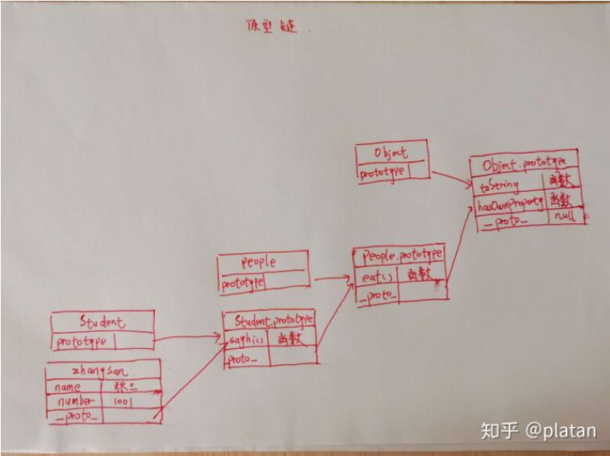
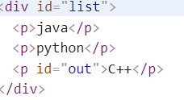
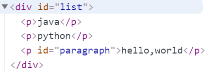
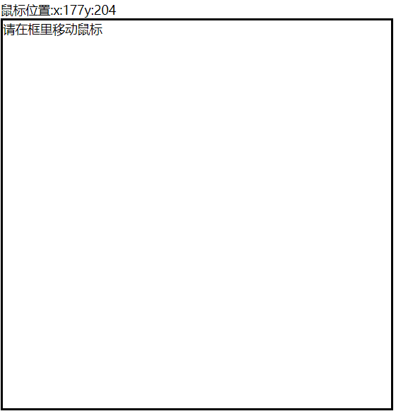

# JavaScript

## 杂项

1. 严格检查模式

防止javascript语法的随意性带来问题

```javascript
<script>
'use strict'//开启严格检查模式，最好写在第一行(这样执行到不规范代码会报错，否则只会在编译器中提醒)
i=0;
</script>
```

2. 原型链



## 操作BOM对象

> window：代表浏览器窗口。

> navigator：封装了浏览器的信息

> screen：操作屏幕尺寸

> location：代表当前页面的URL信息

> document：代表当前页面，HTML，DOM文档树

> history：代表浏览器的历史记录

## 操作DOM对象

**核心：**对DOM结点的增删查改，主要是对`document`对象进行操作。

> 获得DOM节点

```javascript
document.getElementById();//返回结点
document.getElementsByName()
document.getElementsByTagName()
document.getElementsByClassName()//返回数组
```

> 更新节点

```javascript
var h1=document.getElementById("h1");
//给标签内添加文本，如果标签内本来就有内容，会将其覆盖
h1.innerText='123'
//给标签内添加超文本
h1.innerHTML='<a>http://www.baidu.com</a>'

//改变样式，操作css
h1.style.···
//改变颜色
h1.style.color='red'
//改变字体大小
h1.style.fontSize='20px'
```

> 删除结点

步骤：

- 获取父节点
- 通过父节点删除自己

```javascript
let p1=document.getElementById('p1');
let father=p1.parentElement;
father.removeChild(p1);
```

> 插入结点

1. 把一个已有的标签追加到另一个标签中

```html
<p id="out">C++</p>

<div id="list">
    <p>java</p>
    <p>python</p>
</div>

<script>
    'use strict'
    let list = document.getElementById('list');
    let out = document.getElementById('out');
    list.append(out);
</script>
```

效果如下：



ps：

- append用法：**可以同时传入多个节点或字符串，没有返回值。**

- appendchild用法：**只能传一个节点，且不直接支持传字符串。**

2. 创建一个标签，追加到另一个标签中

```html
<div id="list">
    <p>java</p>
    <p>python</p>
</div>

<script>
    'use strict'
    let list = document.getElementById('list');
    let p=document.createElement('p');
    p.id='paragraph'
    p.innerText='hello,world';
    list.append(p);
</script>
```



3. 插入结点

```javascript
let list = document.getElementById('list');
list.insertBefore(newChild,refChild);
```

## 操作表单

### 值操作

```javascript
//得到输入框
let input_text=document.getElementById('username');
//得到值
input_text.value;
//修改值
input_text.value='56146'
```

但是对于单选框和复选框这类的标签，如果根据`id`或者`name`获得值的话，只会获得这个标签指定的值，所以要通过检查该标签是否选中来获得该值。

```html
<form action="">
    <input type="radio" name="gender" id="boy" value="boy">男
    <input type="radio" name="gender" id="girl" value="girl">女
</form>
<script>
    'use strict'
    let boy_radio = document.getElementsById('boy');
    
	//>boy_radio.checked
    //<true
</script>
```

### 提交表单

两种常用的提交按钮

- `<input type="submit" value="提交">`
- `<button type="submit">提交</button>`

还可以通过绑定事件进行提交。

```html
<button type="submit" onclick='fun()'>提交</button>
<script>
    'use strict'
    function fun(){
        
    }

</script>
```

### MD5前端加密

首先引入一个MD5的工具类。

```html
<script src="https://cdn.bootcss.com/blueimp-md5/2.10.0/js/md5.min.js"></script>
```

获得密码值并加密

```javascript
var pwd=document.getElementById('password');
pwd.value=md5(pwd.value);
```

## jQuery

jQuery的两个核心为==选择器==和==事件==

```javascript
$(selector).action()
```

可以理解为，前半段是用来找到相应的元素。后半段指的是为前边的所有匹配的元素执行该事件，这个事件会执行所有绑定到该事件的函数（也就是括号里的函数）。

> 选择器

```javascript
$('#up');//id选择器
$('up');//tag选择器
$('.up');//class选择器
```

除此之外，jQuery可以使用css的全部选择器。

> 事件

我们经常需要在网页加载完毕之后去执行某些方法，用jQuery可以用如下方式实现：

```javascript
//表示当文档加载完毕后相应事件
$(document).ready(function(){
    
});
//可以简化为如下版本:
$(function(){
    
})
```

例子：跟踪鼠标位置并显示到页面中

```html
<span>鼠标位置:</span><span id="mouse"></span>
<div id="box" style="height: 500px;width: 500px;border: solid black;">请在框里移动鼠标</div>

<script>
    'use strict'
    $(function (){
        $('#box').mousemove(function (e){
            $('#mouse').text('x:'+e.pageX+'y:'+e.pageY)
        })
    })
</script>
```

效果如下：



例子二


